# Introduction to R for RNA Sequencing Analysis

**When:**  
**Where:**
[Zoom](https://zoom.us/j/7575820324?pwd=d2UyMEhYZGNiV3kyUFpUL1EwQmthQT09)
and
[](https://mybinder.org/v2/gh/nih-cfde/training-rstudio-binder/data?urlpath=rstudio)  
**Instructors:**  
**Organizer:** [The Common Fund Data
Ecosystem](https://training.nih-cfde.org/)

**Description:** RNA-Sequencing (RNA-Seq) is a popular method for
determining the presence and quantity of RNA in biological samples. In
this 3 hour workshop, we will use R to explore publicly-available
RNA-Seq data from the [Gene Expression Tissue Project
(GTEx)](https://gtexportal.org/home/). Attendees will be introduced to
the R syntax, variables, functions, packages, and data structures common
to RNA-Seq projects. We will use RStudio to import, tidy, transform, and
visualize RNA-Seq count data. Attendees will learn tips and tricks for
making the processes of data wrangling and data harmonization more
manageable. This workshop will not cover cloud-based workflows for
processing RNA-seq reads or statistics and modeling because these topics
are covered in our [RNA-Seq Concepts](https://osf.io/kj5av/) and
[RNA-Seq in the
Cloud](https://github.com/nih-cfde/rnaseq-in-the-cloud/blob/stable/rnaseq-workflow.pdf)
workshops. Rather, this workshop will focus on general R concepts
applied to RNA-Seq data.

:::info

### Learning Objectives

In this workshop, you will learn how to use R and RStudio to:

-   import and view files commonly associated with RNA-sequencing
    experiments
-   select variables and observations that are relevant to research
    questions (tidy)
-   create and rename variables (transform)
-   join data frames by common variables (harmonize)
-   visualize data using bar graphs, scatter plots, and box plots

:::

### Prerequisites

Familiarity with R and RNA Sequencing is not required but would be
useful.

### Tutorial Resources

Please refer to the [RStudio cheat
sheets](https://www.rstudio.com/resources/cheatsheets/) for commonly
used R functions!

## Introduction

The book [“R for Data Science”](https://r4ds.had.co.nz/index.html)
provides an excellent framework for using data science to turn raw data
into understanding, insight, and knowledge. We will use this framework
as an outline for this workshop.

**R** is a statistical computing and data visualization programming
language. **RStudio** is an integrated development environment, or IDE,
for R programming. R and RStudio work on Mac, Linux, and Windows
operating systems. The RStudio layout displays lots of useful
information and allows us to run R code from a script and view and save
outputs all from one interface.

When you start RStudio, you’ll see two key regions in the interface: the
console and the output. When working in R, you can type directly into
the console, or you can type into a script. Saving commands in a script
will make it easier to reproduce. You will learn more as we go along!

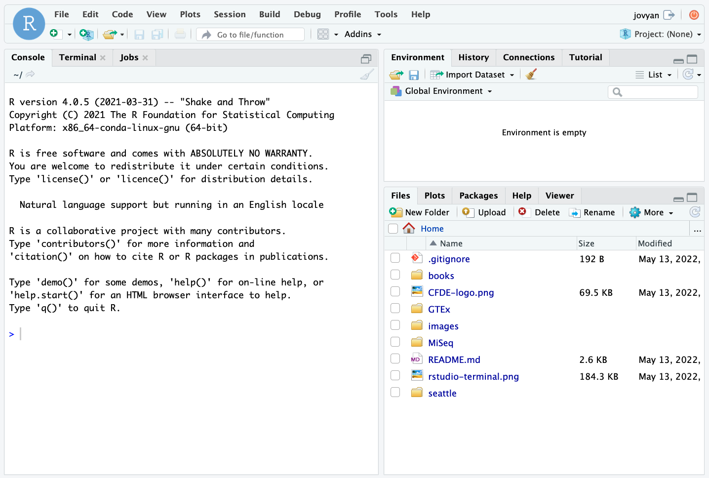

For today’s lesson, we will focus on data from the [Gene-Tissue
Expression (GTEx) Project](https://commonfund.nih.gov/gtex). GTEx is an
ongoing effort to build a comprehensive public resource to study
tissue-specific gene expression and regulation. Samples were collected
from 54 non-diseased tissue sites across nearly 1000 individuals.


### Getting Started

1.  Click the
    [](https://mybinder.org/v2/gh/nih-cfde/training-rstudio-binder/data?urlpath=rstudio)
    button to generate a computing environment for this workshop.
2.  Navigate to the GTEx folder.
3.  Click `GTEx.Rproj` and click “Yes” to open up an Rproject. This will
    set the working directory to `~/GTEx/`.
4.  If you open the `r4rnaseq-workshop.R` file which contains all the
    commands for today’s workshop, you can click through this and all
    the commands should run successfully.
5.  If you open a new R Script by clicking **File > New File > R
    Script**, you can code along by typing out all the commands for
    today’s lesson as I type them.

Click “Run” to send commands from a script to the console or click
command enter.

### R is a calculator

You can perform simple and advanced calculations in R.

``` r
2 + 2 * 100
```

    ## [1] 202

``` r
log10(0.05)
```

    ## [1] -1.30103

You can save variable and recall them later.

``` r
pval <- 0.05
pval
```

    ## [1] 0.05

``` r
-log10(pval)
```

    ## [1] 1.30103

You can save really long lists of things with a short, descriptive names
that are easy to recall later.

``` r
favorite_genes <- c("BRCA1", "JUN",  "GNRH1", "TH", "AR")
favorite_genes
```

    ## [1] "BRCA1" "JUN"   "GNRH1" "TH"    "AR"

### Loading R packages

Many of the functions we will use are pre-installed. The
[Tidyverse](https://www.tidyverse.org/) is a collection of R packages
that include functions, data, and documentation that provide more tools
and capabilities when using R. You can install the popular data
visualization package `ggplot2` with the command
`install.packages("ggplot2")`). It is a good idea to “comment out” this
line of code by adding a `#` at the beginning so that you don’t
re-install the package every time you run the script. For this workshop,
the packages listed in the `.binder/environment.yml` file were
pre-installed with Conda.

``` r
#install.packages("ggplot2")
```

After installing packages, we need to load the functions and tools we
want to use from the package with the `library()` command. Let’s load
the `ggplot2` package.

``` r
library(ggplot2)
```

### Exercise

:::warning

#### Challenge

We will also use functions from the packages `tidyr` and `dplyr` to tidy
and transform data. What command would you run to load these packages?

:::spoiler

`library(tidyr)`  
`library(dplyr)`

:::

You can also navigate to the “Packages” tab in the bottom right pane of
RStudio to view a list of available packages. Packages with a checked
box next to them have been successfully loaded. You can click a box to
load installed packages. Clicking the “Help” Tab will provide a quick
description of the package and its functions.

:::success

### Key functions

| Function             | Description                                  |
|----------------------|----------------------------------------------|
| `<-`                 | The assignment variable                      |
| `log10()`            | A built-in function for a log transformation |
| `install.packages()` | An R function to install packages            |
| `library()`          | The command used to load installed packages  |

:::

## Import Data

Data can be imported using packages from base R or the tidyverse. What
are some differences between the data objects imported by base R
functions such as `read.csv()` and Tidyverse functions such as
`read_csv()`? To begin with, `read.csv()` replaces spaces and dashes
periods in column names, and it also preserves row.names. On the other
hand, `read_csv()` preserves spaces and dashes in column names but drops
the row names. For this workshop, we will use `read_csv()`, which means
we may have to replace dashes with periods so that our sample names in
all objects with sample name information.

## Files

Today, I will show you how to import the following files:

1.  data/samples.csv
2.  data/GTExHeart_20-29_vs_50-59.tsv
3.  data/colData.HEART.csv
4.  data/countData.HEART.csv.gz

Later, you can practice on your own using the following files:

1.  data/GTExMuscle_20-29_vs_50-59.tsv
2.  data/colData.MUSCLE.csv
3.  data/countData.MUSCLE.csv.gz

### `read.csv()`

The `GTExPortal.csv` file in `./data/` contains information about all
the samples in the GTEx portal. Let’s import this file using
`read.csv()`.

``` r
samples <- read.csv("./data/samples.csv")
```

After importing a file, there are multiple ways to view the data.
`head()` to view the first few lines of each file. `names()` will print
just the column names. `str` will compactly displaying the internal
structure. `summary` will compute statistics.

``` r
#View(samples)
head(samples)
```

    ##       SUBJID    SEX   AGE    DTHHRDY                   SAMPID           SMTS
    ## 1 GTEX-1117F Female 60-69 Slow death GTEX-1117F-0226-SM-5GZZ7 Adipose Tissue
    ## 2 GTEX-1117F Female 60-69 Slow death GTEX-1117F-0426-SM-5EGHI         Muscle
    ## 3 GTEX-1117F Female 60-69 Slow death GTEX-1117F-0526-SM-5EGHJ   Blood Vessel
    ## 4 GTEX-1117F Female 60-69 Slow death GTEX-1117F-0626-SM-5N9CS   Blood Vessel
    ## 5 GTEX-1117F Female 60-69 Slow death GTEX-1117F-0726-SM-5GIEN          Heart
    ## 6 GTEX-1117F Female 60-69 Slow death GTEX-1117F-1326-SM-5EGHH Adipose Tissue
    ##   SMNABTCH  SMNABTCHD SMGEBTCHT SMAFRZE SMCENTER SMRIN SMATSSCR
    ## 1 BP-43693 2013-09-17 TruSeq.v1  RNASEQ       B1   6.8        0
    ## 2 BP-43495 2013-09-12 TruSeq.v1  RNASEQ       B1   7.1        0
    ## 3 BP-43495 2013-09-12 TruSeq.v1  RNASEQ       B1   8.0        0
    ## 4 BP-43956 2013-09-25 TruSeq.v1  RNASEQ       B1   6.9        1
    ## 5 BP-44261 2013-10-03 TruSeq.v1  RNASEQ       B1   6.3        1
    ## 6 BP-43495 2013-09-12 TruSeq.v1  RNASEQ       B1   5.9        1

``` r
tail(samples)
```

    ##          SUBJID    SEX   AGE         DTHHRDY                   SAMPID
    ## 1523 GTEX-145ME Female 40-49 Ventilator Case GTEX-145ME-0926-SM-5O9AR
    ## 1524 GTEX-145ME Female 40-49 Ventilator Case GTEX-145ME-1026-SM-5O9B4
    ## 1525 GTEX-145ME Female 40-49 Ventilator Case GTEX-145ME-1126-SM-5SIAT
    ## 1526 GTEX-145ME Female 40-49 Ventilator Case GTEX-145ME-1226-SM-5SIB6
    ## 1527 GTEX-145ME Female 40-49 Ventilator Case GTEX-145ME-1326-SM-5O98Q
    ## 1528 GTEX-145ME Female 40-49 Ventilator Case GTEX-145ME-1426-SM-5RQJS
    ##                 SMTS SMNABTCH  SMNABTCHD SMGEBTCHT SMAFRZE SMCENTER SMRIN
    ## 1523 Small Intestine BP-47675 2013-12-19 TruSeq.v1  RNASEQ       B1   7.4
    ## 1524         Stomach BP-47675 2013-12-19 TruSeq.v1  RNASEQ       B1   7.4
    ## 1525           Colon BP-47616 2013-12-18 TruSeq.v1  RNASEQ       B1   6.9
    ## 1526           Ovary BP-47616 2013-12-18 TruSeq.v1  RNASEQ       B1   7.3
    ## 1527          Uterus BP-47675 2013-12-19 TruSeq.v1  RNASEQ       B1   8.5
    ## 1528          Vagina BP-48437 2014-01-17 TruSeq.v1  RNASEQ       B1   7.2
    ##      SMATSSCR
    ## 1523        1
    ## 1524        1
    ## 1525        1
    ## 1526        1
    ## 1527        1
    ## 1528        1

``` r
str(samples)
```

    ## 'data.frame':    1528 obs. of  13 variables:
    ##  $ SUBJID   : chr  "GTEX-1117F" "GTEX-1117F" "GTEX-1117F" "GTEX-1117F" ...
    ##  $ SEX      : chr  "Female" "Female" "Female" "Female" ...
    ##  $ AGE      : chr  "60-69" "60-69" "60-69" "60-69" ...
    ##  $ DTHHRDY  : chr  "Slow death" "Slow death" "Slow death" "Slow death" ...
    ##  $ SAMPID   : chr  "GTEX-1117F-0226-SM-5GZZ7" "GTEX-1117F-0426-SM-5EGHI" "GTEX-1117F-0526-SM-5EGHJ" "GTEX-1117F-0626-SM-5N9CS" ...
    ##  $ SMTS     : chr  "Adipose Tissue" "Muscle" "Blood Vessel" "Blood Vessel" ...
    ##  $ SMNABTCH : chr  "BP-43693" "BP-43495" "BP-43495" "BP-43956" ...
    ##  $ SMNABTCHD: chr  "2013-09-17" "2013-09-12" "2013-09-12" "2013-09-25" ...
    ##  $ SMGEBTCHT: chr  "TruSeq.v1" "TruSeq.v1" "TruSeq.v1" "TruSeq.v1" ...
    ##  $ SMAFRZE  : chr  "RNASEQ" "RNASEQ" "RNASEQ" "RNASEQ" ...
    ##  $ SMCENTER : chr  "B1" "B1" "B1" "B1" ...
    ##  $ SMRIN    : num  6.8 7.1 8 6.9 6.3 5.9 6.6 6.3 6.5 5.8 ...
    ##  $ SMATSSCR : int  0 0 0 1 1 1 1 1 2 1 ...

``` r
summary(samples)
```

    ##     SUBJID              SEX                AGE              DTHHRDY         
    ##  Length:1528        Length:1528        Length:1528        Length:1528       
    ##  Class :character   Class :character   Class :character   Class :character  
    ##  Mode  :character   Mode  :character   Mode  :character   Mode  :character  
    ##                                                                             
    ##                                                                             
    ##                                                                             
    ##     SAMPID              SMTS             SMNABTCH          SMNABTCHD        
    ##  Length:1528        Length:1528        Length:1528        Length:1528       
    ##  Class :character   Class :character   Class :character   Class :character  
    ##  Mode  :character   Mode  :character   Mode  :character   Mode  :character  
    ##                                                                             
    ##                                                                             
    ##                                                                             
    ##   SMGEBTCHT           SMAFRZE            SMCENTER             SMRIN       
    ##  Length:1528        Length:1528        Length:1528        Min.   : 3.200  
    ##  Class :character   Class :character   Class :character   1st Qu.: 6.300  
    ##  Mode  :character   Mode  :character   Mode  :character   Median : 7.000  
    ##                                                           Mean   : 7.058  
    ##                                                           3rd Qu.: 7.700  
    ##                                                           Max.   :10.000  
    ##     SMATSSCR     
    ##  Min.   :0.0000  
    ##  1st Qu.:0.0000  
    ##  Median :1.0000  
    ##  Mean   :0.8534  
    ##  3rd Qu.:1.0000  
    ##  Max.   :3.0000

Count files can be very long and wide, so it is a good idea to only view
the first (or last) few rows and columns. Typically, a gene identifier
(like an ensemble id) will be used as the row names. We can use `dim` to
see how many rows and columns are in the file.

``` r
counts <- read.csv("./data/countData.HEART.csv", row.names = 1)
dim(counts)
```

    ## [1] 63811   306

``` r
head(counts)[1:5]
```

    ##                 GTEX.12ZZX.0726.SM.5EGKA.1 GTEX.13D11.1526.SM.5J2NA.1
    ## ENSG00000278704                          0                          0
    ## ENSG00000277400                          0                          0
    ## ENSG00000274847                          0                          0
    ## ENSG00000277428                          0                          0
    ## ENSG00000276256                          0                          0
    ## ENSG00000278198                          0                          0
    ##                 GTEX.ZAJG.0826.SM.5PNVA.1 GTEX.11TT1.1426.SM.5EGIA.1
    ## ENSG00000278704                         0                          0
    ## ENSG00000277400                         0                          0
    ## ENSG00000274847                         0                          0
    ## ENSG00000277428                         0                          0
    ## ENSG00000276256                         0                          0
    ## ENSG00000278198                         0                          0
    ##                 GTEX.13VXT.1126.SM.5LU3A.1
    ## ENSG00000278704                          0
    ## ENSG00000277400                          0
    ## ENSG00000274847                          0
    ## ENSG00000277428                          0
    ## ENSG00000276256                          0
    ## ENSG00000278198                          0

This “countData” was generated by using `recount3` as described in the
file `scripts/recount3.Rmd`. It comes from a Ranged Summarized
Experiment (rse) which contains quantitative information about read
counts as well as quality control information and sample descriptions.
The “colData” from an rse can also be obtained. This information
*should* match the information in our samples file, but there can be
subtle differences in formatting We will read the colData in a later
section.

### `read.table()`

Very large tabular files are often saved as .tsv files. These can be
imported with `read.table()` or `read_tsv()`. You can also specify the
tab delimiter as well as the row and column names. You can import files
using the default parameters or you can change them. Because the first
column in the .tsv files does not have a row name, by default,
`read.table()`, imports the first column as the row.names. When
`sep = "\t", header = TRUE` is specified, the fist column is imported as
column one and given the column name `X`.

``` r
results <- read.table("./data/GTEx_Heart_20-29_vs_50-59.tsv")
head(results)
```

    ##               logFC    AveExpr         t    P.Value adj.P.Val         B
    ## A1BG     0.67408600  1.6404652 2.1740238 0.03283291 0.1536518 -3.617093
    ## A1BG-AS1 0.23168690 -0.1864802 1.0403316 0.30150123 0.5316030 -4.984225
    ## A2M      0.02453974  9.8251848 0.1948624 0.84602333 0.9215696 -5.783835
    ## A2M-AS1  0.38115436  2.4535892 2.4839630 0.01520646 0.1033370 -3.067127
    ## A2ML1    0.58865741 -1.0412696 1.8263856 0.07173966 0.2328150 -4.065276
    ## A2MP1    0.31631081 -0.8994146 1.4061454 0.16377753 0.3730822 -4.583435

### Exercise

:::warning

#### Challenge

What commands could you use to read the following files: 1. GTEx results
comparing the **muscle** of 20-29 year old to 50-59 year olds? 1. The
csv file information describing the muscle samples?

:::spoiler

1.  `read.table("./data/GTEx_Muscle_20-29_vs_50-59.tsv")`
2.  `read.csv("./data/countData.MUSCLE.csv", row.names = 1)`

:::

### Summary statistics

You have now seen a variety of options for importing files. You may use
many more in your R-based RNA-seq workflow, but these basics will get
you started. Let’s now explore the functions `summary()`, `length()`,
`dim()`, and `count()` us to quickly summarize and compare data frames
to answer the following questions.

How many samples do we have? Over 1400!

``` r
dim(samples)
```

    ## [1] 1528   13

How many samples are there per tissue?

``` r
dplyr::count(samples, SMTS) 
```

    ##               SMTS   n
    ## 1   Adipose Tissue 134
    ## 2    Adrenal Gland  20
    ## 3     Blood Vessel 139
    ## 4            Brain  82
    ## 5           Breast  50
    ## 6            Colon  78
    ## 7        Esophagus 144
    ## 8            Heart 106
    ## 9           Kidney   6
    ## 10           Liver  28
    ## 11            Lung  78
    ## 12          Muscle 104
    ## 13           Nerve  71
    ## 14           Ovary  16
    ## 15        Pancreas  30
    ## 16       Pituitary  37
    ## 17        Prostate  24
    ## 18  Salivary Gland  22
    ## 19            Skin 160
    ## 20 Small Intestine  23
    ## 21          Spleen  16
    ## 22         Stomach  29
    ## 23          Testis  37
    ## 24         Thyroid  69
    ## 25          Uterus  14
    ## 26          Vagina  11

How many samples are there per tissue and sex? Can we test the effect of
sex on gene expression in all tissues? For many samples, yes, but not
all tissues were samples from both males and females.

``` r
head(dplyr::count(samples, SMTS, SEX))
```

    ##             SMTS    SEX  n
    ## 1 Adipose Tissue Female 40
    ## 2 Adipose Tissue   Male 94
    ## 3  Adrenal Gland Female  7
    ## 4  Adrenal Gland   Male 13
    ## 5   Blood Vessel Female 48
    ## 6   Blood Vessel   Male 91

How many samples are there per sex, age, and hardy scale? Do you have
enough samples to test the effects of Sex, Age, and Hardy Scale in the
Heart?

``` r
head(dplyr::count(samples, SMTS, SEX, AGE, DTHHRDY ) )
```

    ##             SMTS    SEX   AGE                      DTHHRDY n
    ## 1 Adipose Tissue Female 20-29              Ventilator Case 3
    ## 2 Adipose Tissue Female 30-39              Ventilator Case 2
    ## 3 Adipose Tissue Female 40-49 Fast death of natural causes 1
    ## 4 Adipose Tissue Female 40-49              Ventilator Case 5
    ## 5 Adipose Tissue Female 40-49       Violent and fast death 2
    ## 6 Adipose Tissue Female 50-59 Fast death of natural causes 3

### Exercise

:::warning

#### Challenge

What series commands would you use to import the
`data/colData.MUSCLE.csv` and count the number of muscles samples per
sex, age?

How many female muscles samples are there from age group 30-39?

*Hint: use head() or names() after importing a file to verify the
variable names.*

:::spoiler

`df <- read.csv("./data/colData.MUSCLE.csv")`
`dplyr::count(df, SMTS, SEX, AGE)`
`# 3 samples are in the female group age 30-39`

:::

:::success

### Key functions

| Function              | Description                                                     |
|-----------------------|-----------------------------------------------------------------|
| `read.csv()`          | A base R function for importing comma separated tabular data    |
| `read_csv()`          | A tidyR function for importing .csv files as tibbles            |
| `read.table()`        | A base R function for importing tabular data with any delimiter |
| `read_tsv()`          | A tidyR function for importing .tsv files as tibbles            |
| `as_tibble()`         | Convert data frames to tibbles                                  |
| `head()` and `tail()` | Print the first or last 6 lines of an object                    |
| `dim()`               | A function that prints the dimensions of an object              |
| `length()`            | Calculate the length of an object                               |
| `count()`             | A dplyr function that counts number of samples per group        |
| `str()`               | A function that prints the internal structure of an object      |
| `summary()`           | A function that summarizes each variable                        |

:::

## Visualize Data

### `ggplot()`

`ggplot2` is a very popular package for making visualization. It is
built on the “grammar of graphics”. Any plot can be expressed from the
same set of components: a data set, a coordinate system, and a set of
“geoms” or the visual representation of data points such as points,
bars, line, or boxes. This is the template we build on:

    ggplot(data = <DATA>, aes(<MAPPINGS>)) +
      <geom_function>() +
      ...

### `geom_bar()`

We just used the `count()` function to calculate how many samples are in
each group. The function for creating bar graphs (`geom_bar()`) also
makes use of `stat = "count"` to plot the total number of observations
per variable. Let’s use ggplot2 to create a visual representation of how
many samples there are per tissue, sex, and hardiness.

``` r
# Visualizing data with ggplot2

ggplot(samples, aes(x = SMTS)) +
  geom_bar(stat = "count")
```

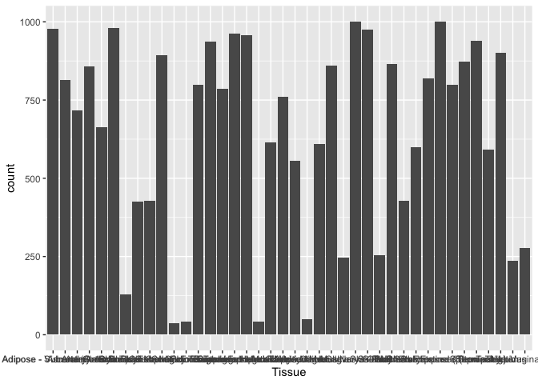<!-- -->


In the last section, we will discuss how to modify the `themes()` to
adjust the axes, legends, and more. For now, let’s flip the x and y
coordinates so that we can read the sample names. We do this by adding a
layer and the function `coord_flip()`

``` r
ggplot(samples, aes(x = SMTS)) +
  geom_bar(stat = "count") + 
  coord_flip()
```

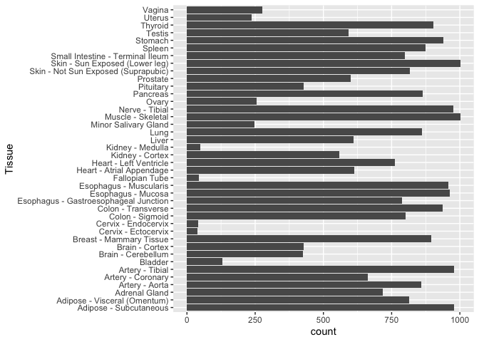<!-- -->


Now, there are two ways we can visualize another variable in addition to
tissue. We can add color or we can add facets.

Let’s first color the data by age bracket. Color is an aesthetic, so it
must go inside the `aes()`. If you include `aes(color = AGE)` inside
`ggplot()`, the color will be applied to every layer in your plot. If
you add `aes(color = AGE)` inside `geom_bar()`, it will only be applied
to that layer (which is important later when you layer multiple geoms.

head(samples)

``` r
ggplot(samples, aes(x = SMTS, color = AGE)) +
  geom_bar(stat = "count") + 
  coord_flip()
```

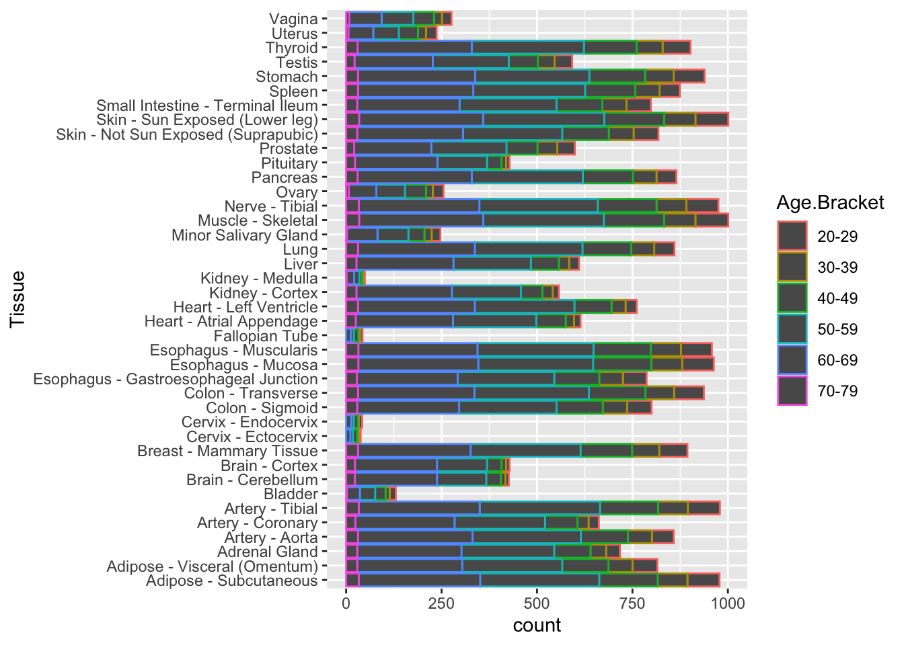<!-- -->


Note that the bars are outlined in a color according to hardy scale. If
instead, you would the bars “filled” with color, use the aesthetic
`aes(fill = AGE)`

``` r
ggplot(samples, aes(x = SMTS, fill = AGE)) +
  geom_bar(stat = "count") + 
  coord_flip()
```

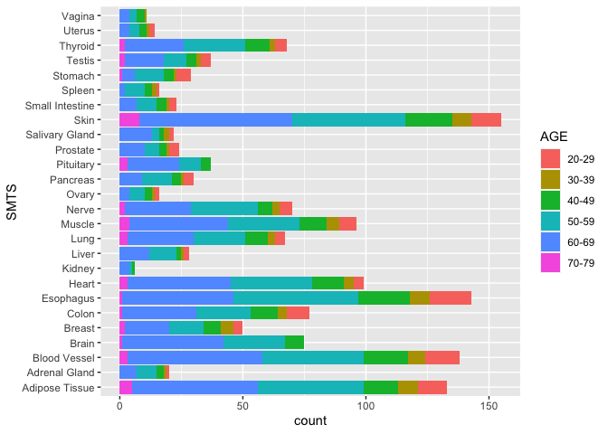<!-- -->


Now, let’s use `facet_wrap(~SEX)` to break the data into two groups
based on the variable sex.

``` r
ggplot(samples, aes(x = SMTS, fill = AGE)) +
  geom_bar(stat = "count") + 
  coord_flip() +
  facet_wrap(~SEX)
```

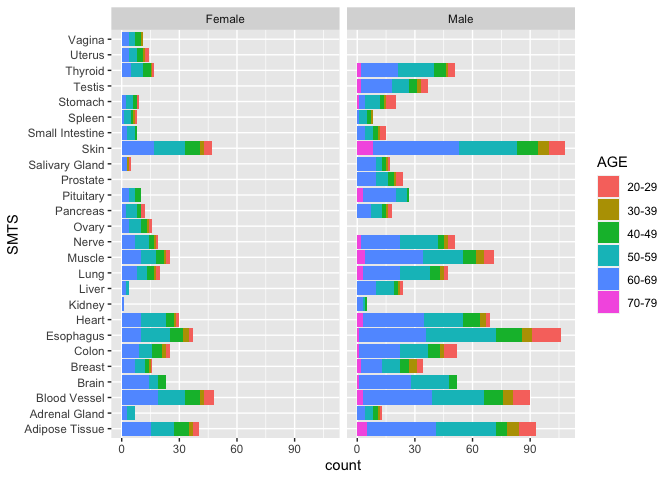<!-- -->


With this graph, we have an excellent overview of the total numbers of
RNA-Seq samples in the GTEx project, and we can see where we are missing
data (for good biological reasons). However, this plot doesn’t show us
Hardy Scale. It’s hard to layer 4 variables, so let’s remove Tissue as a
variable by focusing just on one Tissue.

## Exercise

:::warning

#### Challenge

Create a plot showing the total number of samples per Sex, Age Bracket,
and Hardy Scale for *just* the Heart samples. Paste the code you used in
the chat.

:::spoiler

There are many options. Here are a few.

      ggplot(samples, aes(x = DTHHRDY, fill = AGE))  +
          geom_bar(stat = "count") +
          facet_wrap(~SEX) 
        
      ggplot(samples, aes(x = AGE, fill = as.factor(DTHHRDY)))  +
          geom_bar(stat = "count") +
          facet_wrap(~SEX) 

:::

One thing these plots show us is that we don’t have enough samples to
test the effects of all our experimental variables (age, sex, tissue,
and hardy scale) and their interactions on gene expression. We can,
however, focus on one or two variables or groups at a time.

### `geom_point()`

Earlier, we imported the file “data/GTEx_Heart_20-29_vs_50-59.tsv”)” and
saved it as “results”. This file contains the results of a differential
gene expression analysis comparing heart tissue from 20-29 to heart
tissue from 50-59 year olds. This is a one-way design investigating only
the effect of age (but not sex or hardy scale) on gene expression in the
heart. Let’s visualize these results.

[Volcano Plots](https://en.wikipedia.org/wiki/Volcano_plot_(statistics))
are a type of scatter plots that show the log fold change (logFC) on the
x axis and the inverse log (`-log10()`) of a p-value that has been
corrected for multiple hypothesis testing (adj.P.Val). Let’s create a
Volcano Plot using the `gplot()` and `geom_point()`. *Note: this may
take a minute because there are 15,000 points that must be plotted*

``` r
ggplot(results, aes(x = logFC, y = -log10(adj.P.Val))) +
  geom_point() 
```

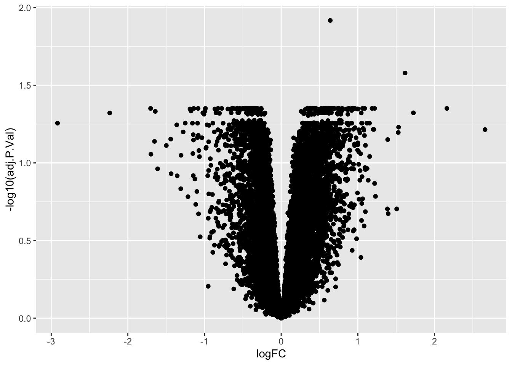<!-- -->


The inverse log of p \< 05 is 1.30103. We can add a horizontal line to
our plot using `geom_hline()` so that we can visually see how many genes
or points are significant and how many are not.

``` r
ggplot(results, aes(x = logFC, y = -log10(adj.P.Val))) +
  geom_point() +
  geom_hline(yintercept = -log10(0.05))
```

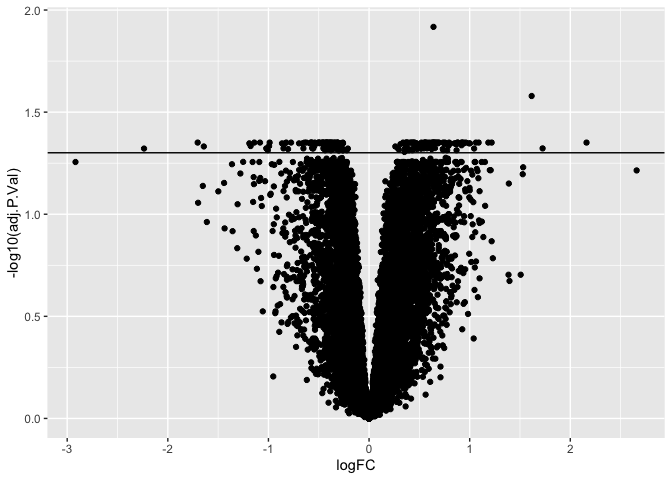<!-- -->


``` r
ggplot(results, aes(x = logFC, y = -log10(adj.P.Val))) +
  geom_point(aes(color = ifelse( adj.P.Val < 0.05, "p < 0.05", "NS"))) +
  geom_hline(yintercept = -log10(0.05)) 
```

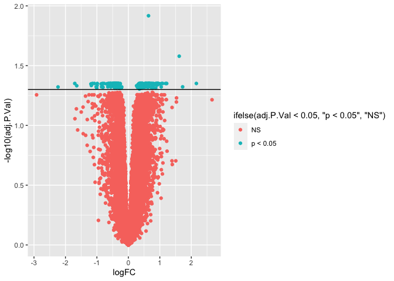<!-- -->


``` r
ggplot(results, aes(x = logFC, y = -log10(adj.P.Val))) +
  geom_point(aes(color = ifelse( adj.P.Val < 0.05, "p < 0.05", "NS"))) +
  geom_hline(yintercept = -log10(0.05))  +
  theme(legend.position = "bottom") +
  labs(color = "20-29 vs 50-59 year olds", 
       subtitle = "Heart Tissue Gene Expression")
```

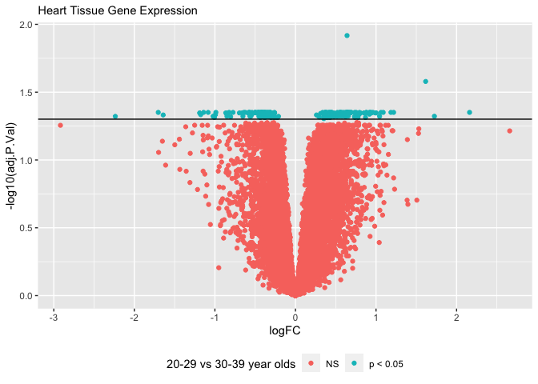<!-- -->


### Exercise

:::warning

#### Challenge

Create a volcano plot for the results comparing the **muscle** tissue of
20-29 year olds to that of 50-59 year olds? Are there more or less
differential expressed genes in the muscle compared to the heart for
this age group?

:::spoiler

      df <- read.table("./data/GTEx_Muscle_20-29_vs_50-59.tsv")

      ggplot(df, aes(x = logFC, y = -log10(adj.P.Val))) +
        geom_point() +
        geom_hline(yintercept = -log10(0.05))
      
      # More  

### `geom_boxplot()`

:::

In addition to containing information about the donor tissue, the
samples file contains has a column with a RIN score, which tells us
about the quality of the data. If we wanted to look for interactions
between RIN score (SMRIN) and sequencing facility (SMCENTER), we can use
a box plot.

``` r
ggplot(samples, aes(x = SMCENTER, y = SMRIN)) +
  geom_boxplot() +
  geom_jitter(aes(color = SMRIN))
```

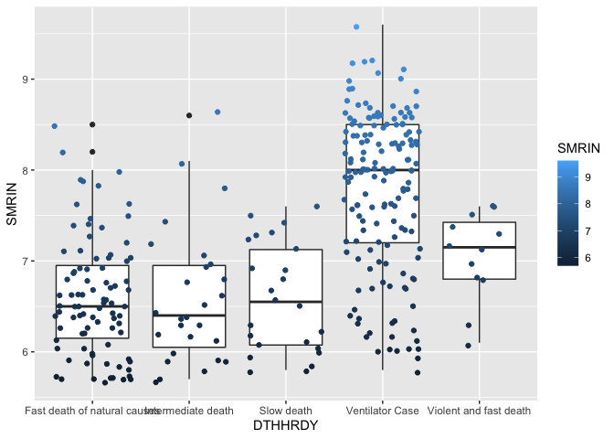<!-- -->


Now you know a handful of R functions for importing, summarizing, and
visualizing data. In the next section, we will tidy and transform our
data so that we can make even better summaries and figures. In the last
section, you will learn ggplot function for making fancier figures.

:::success

### Key functions

| Function       | Description                                                                                                             |
|----------------|-------------------------------------------------------------------------------------------------------------------------|
| `ggplot2`      | An open-source data visualization package for the statistical programming language R                                    |
| `ggplot()`     | The function used to construct the initial plot object, and is almost always followed by + to add component to the plot |
| `aes()`        | Aesthetic mappings that describe how variables in the data are mapped to visual properties (aesthetics) of geoms        |
| `geom_point()` | A function used to create scatter plots                                                                                 |
| `geom_bar()`   | A function used to create bar plots                                                                                     |
| `coord_flip()` | Flips the x and y axis                                                                                                  |
| `geom_hline()` | Add a horizontal line to plots                                                                                          |

:::

## Wrangle (or Tidy and Tranform) Data

[Data wrangling](https://en.wikipedia.org/wiki/Data_wrangling) is the
process of tidying and transforming data to make it more appropriate and
valuable for a variety of downstream purposes such as analytics. The
goal of data wrangling is to assure quality and useful data. Data
analysts typically spend the majority of their time in the process of
data wrangling compared to the actual analysis of the data.

**Tidying** your data means storing it in a consistent form. When your
data is tidy, each column is a variable, and each row is an observation.
Tidy data is important because the consistent structure lets you focus
your struggle on questions about the data, not fighting to get the data
into the right form for different functions. Some tidying functions
include `pivot_longer()`, `pivot_wider()`, `separate()`, `unite()`,
`drop_na()`, `replace_na()`. The “lubridate” package has a number of
functions for tidying dates. You may also use `mutate()` function to
convert objects from, say, characters or integers to factors or rename
observations and variables.

**Transforming** your data includes narrowing in on observations of
interest (like all people in one city, or all data from the last year),
creating new variables that are functions of existing variables (like
computing speed from distance and time), and calculating a set of
summary statistics (like counts or means). Summary functions such as
`summarize()` and `count()` to create new tables with statistics. Before
summarizing or counting a whole data frame, you can use `group_by()` to
group variables. You can use `filter()` and `select()` to isolate
specific rows or columns, respectively. If you want to sort columns,
`arrange()` and `arrange(desc())` are two functions to familiarize
yourself with.

**Combining tables** can be accomplished in one of two ways. If all the
columns or all the rows have all the same names, you can use `rbind()`
or `cbind()`, respectively, to join the data frames. If however, each
data frame have a column (or multiple columns) that contain unique
identifiers, then you can use the family of join functions
(`inner_join()`, `outter_join()`, `left_join()`, and `right_join()`)

For each downstream analysis, you will likely use a series of tidying
and transforming steps in various order to get your data in the
appropriate format. Interest of creating dozens of intermediate files
after each step, we will use the `%>%` operator to “pipe” the output of
one function to the input of the other.

Instead of going into each function or each process in detail in
isolation, let’s start with some typical research questions and then
piece together R functions to get the desired information

### `filter()`

Filter is done in a few different ways depending on the type of
variable. You can use `>` and less `<` to filter greater or less than a
number. `==` and `!=` are used to filter by characters or factors that
match or do not match a specific pattern. `%in% c()` is used to filter
by things in a list. Let’s filter by adjusted p-value. You can use `|`
and `&` to mean “or” or “and”

To explore filtering data, let’s answer the following question: What are
the approved names and symbols of the differentially expressed genes
(DEGs) in the heart tissue between 20-29 and 30-29 year olds? To answer
this question, we need a subset of information from both the results and
genes files. We need, in no particular order, to:

1.  filter by adj.p.value \< 0.05 (or desired alpha)
2.  filter by results by logFC > 1 or \<-1
3.  filter by a list of gene symbols

``` r
# Tidy and Transform Data

results %>% 
  filter(adj.P.Val < 0.05) %>% 
  head()
```

    ##            logFC  AveExpr         t      P.Value  adj.P.Val          B
    ## AAGAB -0.4011097 4.904460 -4.013690 0.0001394737 0.02151260  0.8922610
    ## ABCA6  0.7016965 5.597551  3.502285 0.0007779680 0.03216746 -0.6657214
    ## ABCA9  0.6970969 6.237353  3.114336 0.0026040559 0.04866231 -1.7334759
    ## ABCB7 -0.3708764 5.088921 -3.134484 0.0024510401 0.04755891 -1.6840509
    ## ABCD3 -0.6082187 6.190704 -3.966022 0.0001646305 0.02282632  0.7409476
    ## ABCE1 -0.3764537 5.332213 -3.336582 0.0013173889 0.03802552 -1.1360534

``` r
results %>% 
  filter(logFC > 1 | logFC < -1) %>%
  head()
```

    ##              logFC   AveExpr         t     P.Value  adj.P.Val          B
    ## ACTA1    -1.358451 10.437939 -2.446102 0.016765666 0.10888918 -3.1289828
    ## ADAMTSL2  1.338257  5.208146  2.900833 0.004871530 0.06245142 -2.2916348
    ## ADH1B     1.259668  7.381462  3.382176 0.001141426 0.03624785 -0.9658612
    ## ADIPOQ   -1.119484  1.117207 -1.720643 0.089405972 0.26371302 -4.3157948
    ## AJAP1     1.010117 -1.212201  2.790425 0.006659281 0.07018819 -2.4766685
    ## ALAS2     1.122494 -1.039829  1.840601 0.069603628 0.22901993 -4.0459220

### `filter()`

Sometimes its nice to arrange by p-value. By default, the `arrange()`
function will sort characters alphabetically and numbers in ascending
order. Use `arrange(desc())` to sort in the reverse order.

``` r
results %>% filter(adj.P.Val < 0.05,
                   logFC > 1 | logFC < -1) %>%
  arrange(adj.P.Val) %>%
  head()
```

    ##                  logFC    AveExpr         t      P.Value    adj.P.Val         B
    ## EDA2R         1.253278  1.0260046  6.019187 5.853141e-08 0.0004544671 6.8806284
    ## PTCHD4        1.962957 -1.7174066  6.067597 4.781186e-08 0.0004544671 5.4766844
    ## BTBD11       -1.194207  0.4506981 -5.289726 1.153068e-06 0.0044764970 4.2906292
    ## MTHFD2P1      1.825674 -1.6578790  5.341073 9.392086e-07 0.0044764970 3.5204863
    ## C4orf54      -2.824211  2.7276196 -4.502382 2.398852e-05 0.0159674585 2.4089730
    ## LOC101929331  1.129013 -1.6306733  4.312543 4.813231e-05 0.0175055847 0.8558573

``` r
resultsDEGs <- results %>% filter(adj.P.Val < 0.05,
                   logFC > 1 | logFC < -1) %>%
  arrange(adj.P.Val) %>% 
  rownames(.)
resultsDEGs
```

    ##  [1] "EDA2R"        "PTCHD4"       "BTBD11"       "MTHFD2P1"     "C4orf54"     
    ##  [6] "LOC101929331" "FMO3"         "KLHL41"       "ETNPPL"       "HOPX"        
    ## [11] "PDIA2"        "RPL10P7"      "FCMR"         "RAD9B"        "LMO3"        
    ## [16] "NXF3"         "FHL1"         "EREG"         "CHMP1B2P"     "MYPN"        
    ## [21] "VIT"          "XIRP1"        "DNASE1L3"     "LIPH"         "PRELP"       
    ## [26] "CSRP3"        "FZD10-AS1"    "LINC02268"    "GDF15"        "PHF21B"      
    ## [31] "CPXM1"        "IL24"         "ADH1B"        "MCF2"         "WWC1"        
    ## [36] "SGPP2"        "COL24A1"      "SEC24AP1"     "ANKRD1"       "CDO1"        
    ## [41] "CCL28"        "SLC5A10"      "XIRP2"

#### Exercise

:::warning

#### Challenge

Replace the input results file with a different file, such as the
results of the comparison of 20-29 and 50-59 year old heart samples.
What are the deferentially expressed genes?

:::spoiler

You could use the following code to get this result below

``` r
resultsDEGs2 <- read.table("./data/GTEx_Heart_20-29_vs_50-59.tsv") %>% 
  filter(adj.P.Val < 0.05,
                   logFC > 1 | logFC < -1) %>%
  arrange(adj.P.Val) %>% 
  rownames(.)
resultsDEGs2

[1] "EDA2R"        "PTCHD4"       "BTBD11"       "MTHFD2P1"     "C4orf54"      "LOC101929331"
[7] "FMO3"         "KLHL41"       "ETNPPL"       "HOPX"         "PDIA2"        "RPL10P7"     
[13] "FCMR"         "RAD9B"        "LMO3"         "NXF3"         "FHL1"         "EREG"        
[19] "CHMP1B2P"     "MYPN"         "VIT"          "XIRP1"        "DNASE1L3"     "LIPH"        
[25] "PRELP"        "CSRP3"        "FZD10-AS1"    "LINC02268"    "GDF15"        "PHF21B"      
[31] "CPXM1"        "IL24"         "ADH1B"        "MCF2"         "WWC1"         "SGPP2"       
[37] "COL24A1"      "SEC24AP1"     "ANKRD1"       "CDO1"         "CCL28"        "SLC5A10"     
[43] "XIRP2" 
```

:::

### `mutate()`

Most RNA-Seq pipelines require that the counts file to be in a matrix
format where each sample is a column and each gene is a row and all the
values are integers or doubles with all the experimental factors in a
separate file. More over, we need a corresponding file where the row
names are the sample id and they match the column names of the counts
file.

When you type `rownames(colData) == colnames(counts)` you should see
many TRUE statments. If the answer if FALSE your data cannot be
processed by downstream tools.

``` r
colData <- read.csv("./data/colData.HEART.csv", row.names = 1)
head(colData)
```

    ##                                                SAMPID  SMTS
    ## GTEX-12ZZX-0726-SM-5EGKA.1 GTEX-12ZZX-0726-SM-5EGKA.1 Heart
    ## GTEX-13D11-1526-SM-5J2NA.1 GTEX-13D11-1526-SM-5J2NA.1 Heart
    ## GTEX-ZAJG-0826-SM-5PNVA.1   GTEX-ZAJG-0826-SM-5PNVA.1 Heart
    ## GTEX-11TT1-1426-SM-5EGIA.1 GTEX-11TT1-1426-SM-5EGIA.1 Heart
    ## GTEX-13VXT-1126-SM-5LU3A.1 GTEX-13VXT-1126-SM-5LU3A.1 Heart
    ## GTEX-14ASI-0826-SM-5Q5EB.1 GTEX-14ASI-0826-SM-5Q5EB.1 Heart
    ##                                               SMTSD     SUBJID    SEX   AGE
    ## GTEX-12ZZX-0726-SM-5EGKA.1 Heart - Atrial Appendage GTEX-12ZZX Female 40-49
    ## GTEX-13D11-1526-SM-5J2NA.1 Heart - Atrial Appendage GTEX-13D11 Female 50-59
    ## GTEX-ZAJG-0826-SM-5PNVA.1    Heart - Left Ventricle  GTEX-ZAJG Female 50-59
    ## GTEX-11TT1-1426-SM-5EGIA.1 Heart - Atrial Appendage GTEX-11TT1   Male 20-29
    ## GTEX-13VXT-1126-SM-5LU3A.1   Heart - Left Ventricle GTEX-13VXT Female 20-29
    ## GTEX-14ASI-0826-SM-5Q5EB.1 Heart - Atrial Appendage GTEX-14ASI   Male 60-69
    ##                            SMRIN                      DTHHRDY        SRA
    ## GTEX-12ZZX-0726-SM-5EGKA.1   7.1       Violent and fast death SRR1340617
    ## GTEX-13D11-1526-SM-5J2NA.1   8.9              Ventilator Case SRR1345436
    ## GTEX-ZAJG-0826-SM-5PNVA.1    6.4           Intermediate death SRR1367456
    ## GTEX-11TT1-1426-SM-5EGIA.1   9.0              Ventilator Case SRR1378243
    ## GTEX-13VXT-1126-SM-5LU3A.1   8.6              Ventilator Case SRR1381693
    ## GTEX-14ASI-0826-SM-5Q5EB.1   6.4 Fast death of natural causes SRR1335164
    ##                                  DATE
    ## GTEX-12ZZX-0726-SM-5EGKA.1 2013-10-22
    ## GTEX-13D11-1526-SM-5J2NA.1 2013-12-04
    ## GTEX-ZAJG-0826-SM-5PNVA.1  2013-10-31
    ## GTEX-11TT1-1426-SM-5EGIA.1 2013-10-24
    ## GTEX-13VXT-1126-SM-5LU3A.1 2013-12-17
    ## GTEX-14ASI-0826-SM-5Q5EB.1 2014-01-17

``` r
head(rownames(colData) == colnames(counts))
```

    ## [1] FALSE FALSE FALSE FALSE FALSE FALSE

``` r
head(colnames(counts))
```

    ## [1] "GTEX.12ZZX.0726.SM.5EGKA.1" "GTEX.13D11.1526.SM.5J2NA.1"
    ## [3] "GTEX.ZAJG.0826.SM.5PNVA.1"  "GTEX.11TT1.1426.SM.5EGIA.1"
    ## [5] "GTEX.13VXT.1126.SM.5LU3A.1" "GTEX.14ASI.0826.SM.5Q5EB.1"

``` r
head(rownames(colData))
```

    ## [1] "GTEX-12ZZX-0726-SM-5EGKA.1" "GTEX-13D11-1526-SM-5J2NA.1"
    ## [3] "GTEX-ZAJG-0826-SM-5PNVA.1"  "GTEX-11TT1-1426-SM-5EGIA.1"
    ## [5] "GTEX-13VXT-1126-SM-5LU3A.1" "GTEX-14ASI-0826-SM-5Q5EB.1"

The row and col names don’t match because the the dashes were replaced
with periods when the data were imported. This is kind of okay because
`DESeq2` would complain if your colnames had dashes. We can use `gsub()`
to replace the dashes with periods.

``` r
colData_tidy <-  colData %>%
  mutate(SAMPID = gsub("-", ".", SAMPID))  
rownames(colData_tidy) <- colData_tidy$SAMPID

mycols <- rownames(colData_tidy)
head(mycols)
```

    ## [1] "GTEX.12ZZX.0726.SM.5EGKA.1" "GTEX.13D11.1526.SM.5J2NA.1"
    ## [3] "GTEX.ZAJG.0826.SM.5PNVA.1"  "GTEX.11TT1.1426.SM.5EGIA.1"
    ## [5] "GTEX.13VXT.1126.SM.5LU3A.1" "GTEX.14ASI.0826.SM.5Q5EB.1"

Then, we rename the row names. We can use `select(all_of())` to make
sure that all the rows in colData are represented at columns in
countData. We could modify the original files, but since they are so
large and importing taking a long time, I like to save “tidy” versions
for downstream analyses.

``` r
counts_tidy <- counts %>%
  select(all_of(mycols))

head(rownames(colData_tidy) == colnames(counts_tidy))
```

    ## [1] TRUE TRUE TRUE TRUE TRUE TRUE

### `left_join()`

Genes can be identified by their name, their symbol, an Ensemble ID, or
any number of other identifiers. Our results file uses gene symbols, but
our counts file uses Ensemble IDs.

Let’s read a file called “genes.txt” and combine this with our results
file so that we have gene symbols, names, and ids, alongside with the
p-values and other statistics.

``` r
genes <- read.table("./data/ensembl_genes.tsv", sep = "\t",  header = T, fill = T)
head(genes)
```

    ##                id     name
    ## 1 ENSG00000000003   TSPAN6
    ## 2 ENSG00000000005     TNMD
    ## 3 ENSG00000000419     DPM1
    ## 4 ENSG00000000457    SCYL3
    ## 5 ENSG00000000460 C1orf112
    ## 6 ENSG00000000938      FGR
    ##                                                                                      description
    ## 1                                              tetraspanin 6 [Source:HGNC Symbol;Acc:HGNC:11858]
    ## 2                                                tenomodulin [Source:HGNC Symbol;Acc:HGNC:17757]
    ## 3 dolichyl-phosphate mannosyltransferase subunit 1, catalytic [Source:HGNC Symbol;Acc:HGNC:3005]
    ## 4                                   SCY1 like pseudokinase 3 [Source:HGNC Symbol;Acc:HGNC:19285]
    ## 5                        chromosome 1 open reading frame 112 [Source:HGNC Symbol;Acc:HGNC:25565]
    ## 6              FGR proto-oncogene, Src family tyrosine kinase [Source:HGNC Symbol;Acc:HGNC:3697]
    ##                                                                                                                                                                                                                                                                                                                                                                                                                                                                                                             synonyms
    ## 1                                                                                                                                                                                                                                                              [ENTREZ:7105, HGNC:11858, MIM:300191, NM_001278740, NM_001278741, NM_001278742, NM_001278743, NM_003270, NP_001265669, NP_001265670, NP_001265671, NP_001265672, NP_003261, T245, TM4SF6, TSPAN-6, TSPAN6, XM_011531018, XP_011529320, tetraspanin 6]
    ## 2                                                                                                                                                                                                                                                                                                                                                                                                                [BRICD4, CHM1L, ENTREZ:64102, HGNC:17757, MIM:300459, NM_022144, NP_071427, TEM, TNMD, tenomodulin]
    ## 3                                                                                                                                                                                                                                              [CDGIE, DPM1, ENTREZ:8813, HGNC:3005, MIM:603503, MPDS, NM_001317034, NM_001317035, NM_001317036, NM_003859, NP_001303963, NP_001303964, NP_001303965, NP_003850, NR_133648, XR_002958550, XR_002958551, dolichyl-phosphate mannosyltransferase subunit 1, catalytic]
    ## 4                                                                                         [ENTREZ:57147, HGNC:19285, MIM:608192, NM_020423, NM_181093, NP_065156, NP_851607, PACE-1, PACE1, SCY1 like pseudokinase 3, SCYL3, XM_006711465, XM_011509801, XM_011509802, XM_011509803, XM_017001862, XM_017001863, XM_017001864, XM_017001865, XM_024448565, XP_006711528, XP_011508103, XP_011508104, XP_011508105, XP_016857351, XP_016857352, XP_016857353, XP_016857354, XP_024304333, XR_001737335, XR_001737336]
    ## 5 [C1orf112, ENTREZ:55732, HGNC:25565, NM_001320047, NM_001320048, NM_001320050, NM_001320051, NM_001363739, NM_001366768, NM_001366769, NM_001366770, NM_001366771, NM_001366772, NM_001366773, NM_018186, NP_001306976, NP_001306977, NP_001306979, NP_001306980, NP_001350668, NP_001353697, NP_001353698, NP_001353699, NP_001353700, NP_001353701, NP_001353702, NR_159440, XM_011509735, XM_017001722, XM_017001723, XP_011508037, XP_016857211, XP_016857212, XR_921872, chromosome 1 open reading frame 112]
    ## 6                                      [ENTREZ:2268, FGR proto-oncogene, Src family tyrosine kinase, FGR, HGNC:3697, MIM:164940, NM_001042729, NM_001042747, NM_005248, NP_001036194, NP_001036212, NP_005239, SRC2, XM_006710452, XM_011541010, XM_011541011, XM_011541012, XM_011541013, XM_011541014, XM_017000673, XM_017000674, XP_006710515, XP_011539312, XP_011539313, XP_011539314, XP_011539315, XP_011539316, XP_016856162, XP_016856163, XR_946583, c-fgr, c-src2, p55-Fgr, p55c-fgr, p58-Fgr, p58c-fgr]
    ##        organism
    ## 1 NCBI:txid9606
    ## 2 NCBI:txid9606
    ## 3 NCBI:txid9606
    ## 4 NCBI:txid9606
    ## 5 NCBI:txid9606
    ## 6 NCBI:txid9606

The column with genes symbols is called `name`. To combine this data
frame without results. We can use the mutate function to create a new
column based off the row names. Let’s save this as `resultsSymbol`.

``` r
resultsSymbol <- results %>%
  mutate(name = row.names(.))
head(resultsSymbol)
```

    ##               logFC    AveExpr         t    P.Value adj.P.Val         B
    ## A1BG     0.67408600  1.6404652 2.1740238 0.03283291 0.1536518 -3.617093
    ## A1BG-AS1 0.23168690 -0.1864802 1.0403316 0.30150123 0.5316030 -4.984225
    ## A2M      0.02453974  9.8251848 0.1948624 0.84602333 0.9215696 -5.783835
    ## A2M-AS1  0.38115436  2.4535892 2.4839630 0.01520646 0.1033370 -3.067127
    ## A2ML1    0.58865741 -1.0412696 1.8263856 0.07173966 0.2328150 -4.065276
    ## A2MP1    0.31631081 -0.8994146 1.4061454 0.16377753 0.3730822 -4.583435
    ##              name
    ## A1BG         A1BG
    ## A1BG-AS1 A1BG-AS1
    ## A2M           A2M
    ## A2M-AS1   A2M-AS1
    ## A2ML1       A2ML1
    ## A2MP1       A2MP1

Now, we can use one of the join functions to combine two data frames.
`left_join` will return all records from the left table and any matching
values from the right. `right_join` will return all values from the
right table and any matching values from the left. `inner_join` will
return records that have values in both tables. `full_join` will return
everything.

``` r
resultsName <- left_join(resultsSymbol, genes, by = "name")
head(resultsName)
```

    ##        logFC    AveExpr         t    P.Value adj.P.Val         B     name
    ## 1 0.67408600  1.6404652 2.1740238 0.03283291 0.1536518 -3.617093     A1BG
    ## 2 0.23168690 -0.1864802 1.0403316 0.30150123 0.5316030 -4.984225 A1BG-AS1
    ## 3 0.02453974  9.8251848 0.1948624 0.84602333 0.9215696 -5.783835      A2M
    ## 4 0.38115436  2.4535892 2.4839630 0.01520646 0.1033370 -3.067127  A2M-AS1
    ## 5 0.58865741 -1.0412696 1.8263856 0.07173966 0.2328150 -4.065276    A2ML1
    ## 6 0.31631081 -0.8994146 1.4061454 0.16377753 0.3730822 -4.583435    A2MP1
    ##                id
    ## 1 ENSG00000121410
    ## 2            <NA>
    ## 3            <NA>
    ## 4            <NA>
    ## 5 ENSG00000166535
    ## 6            <NA>
    ##                                                        description
    ## 1           alpha-1-B glycoprotein [Source:HGNC Symbol;Acc:HGNC:5]
    ## 2                                                             <NA>
    ## 3                                                             <NA>
    ## 4                                                             <NA>
    ## 5 alpha-2-macroglobulin like 1 [Source:HGNC Symbol;Acc:HGNC:23336]
    ## 6                                                             <NA>
    ##                                                                                                                                                                                                                                                                                                                 synonyms
    ## 1                                                                                                                                                                                                            [A1B, A1BG, ABG, ENTREZ:1, GAB, HGNC:5, HYST2477, MIM:138670, NM_130786, NP_570602, alpha-1-B glycoprotein]
    ## 2                                                                                                                                                                                                                                                                                                                   <NA>
    ## 3                                                                                                                                                                                                                                                                                                                   <NA>
    ## 4                                                                                                                                                                                                                                                                                                                   <NA>
    ## 5 [A2ML1, CPAMD9, ENTREZ:144568, HGNC:23336, MIM:610627, NM_001282424, NM_144670, NP_001269353, NP_653271, OMS, XM_011520566, XM_011520567, XM_017018868, XM_017018869, XM_017018870, XP_011518868, XP_011518869, XP_016874357, XP_016874358, XP_016874359, XR_001748594, XR_931275, alpha-2-macroglobulin like 1, p170]
    ## 6                                                                                                                                                                                                                                                                                                                   <NA>
    ##        organism
    ## 1 NCBI:txid9606
    ## 2          <NA>
    ## 3          <NA>
    ## 4          <NA>
    ## 5 NCBI:txid9606
    ## 6          <NA>

Congratulations! You have successfully joined two tables. Now, you can
filter and select columsn to make a pretty table of the DEGS.

.

``` r
resultsNameTidy <- resultsName %>%
  filter(adj.P.Val < 0.05,
                   logFC > 1 | logFC < -1) %>%
  arrange(adj.P.Val) %>%
  select(name, description, id, logFC, AveExpr, adj.P.Val)
head(resultsNameTidy)
```

    ##           name
    ## 1        EDA2R
    ## 2       PTCHD4
    ## 3       BTBD11
    ## 4     MTHFD2P1
    ## 5      C4orf54
    ## 6 LOC101929331
    ##                                                              description
    ## 1                                                                   <NA>
    ## 2        patched domain containing 4 [Source:HGNC Symbol;Acc:HGNC:21345]
    ## 3                                                                   <NA>
    ## 4                                                                   <NA>
    ## 5 chromosome 4 open reading frame 54 [Source:HGNC Symbol;Acc:HGNC:27741]
    ## 6                                                                   <NA>
    ##                id     logFC    AveExpr    adj.P.Val
    ## 1            <NA>  1.253278  1.0260046 0.0004544671
    ## 2 ENSG00000244694  1.962957 -1.7174066 0.0004544671
    ## 3            <NA> -1.194207  0.4506981 0.0044764970
    ## 4            <NA>  1.825674 -1.6578790 0.0044764970
    ## 5 ENSG00000248713 -2.824211  2.7276196 0.0159674585
    ## 6            <NA>  1.129013 -1.6306733 0.0175055847

### `drop_na()` and `pull()`

Now, let’s make a list of the Ensemble IDs of the DEGs. We can use the
`drop_na()` function to drop genes without Ensemble IDs, and we can use
`pull()` to convert a column in a data frame to a list. .

``` r
resultsNameTidyIds <- resultsNameTidy %>%
  drop_na(id) %>%
  pull(id)
resultsNameTidyIds
```

    ##  [1] "ENSG00000244694" "ENSG00000248713" "ENSG00000007933" "ENSG00000239474"
    ##  [5] "ENSG00000185615" "ENSG00000022267" "ENSG00000138347" "ENSG00000205221"
    ##  [9] "ENSG00000188783" "ENSG00000088882" "ENSG00000196616"

### `pivot_longer()`

The matrix form of the count data is required for some pipelines, but
many R programs are better suited to data in a long format where each
row is an observation. I like to create `counts_tidy_long` file that can
be easily subset by variables or genes of interest.

Because the count files are so large, it is good to filter the counts
first. I’ll filter by `rowSums(.) > 0` and then take the top 6 with
`head()`. Then crate a column for lengthening.

``` r
counts_tidy_slim <- counts_tidy %>%
  mutate(id = row.names(.)) %>%
  filter(id %in% resultsNameTidyIds)
dim(counts_tidy_slim)
```

    ## [1]  11 307

``` r
head(counts_tidy_slim)[1:5]
```

    ##                 GTEX.12ZZX.0726.SM.5EGKA.1 GTEX.13D11.1526.SM.5J2NA.1
    ## ENSG00000007933                       9772                      16299
    ## ENSG00000188783                    2372757                    3306346
    ## ENSG00000138347                     656172                     692042
    ## ENSG00000185615                      14385                      10734
    ## ENSG00000205221                     137920                     192318
    ## ENSG00000239474                     329732                     201574
    ##                 GTEX.ZAJG.0826.SM.5PNVA.1 GTEX.11TT1.1426.SM.5EGIA.1
    ## ENSG00000007933                     32826                       2685
    ## ENSG00000188783                   2121770                     272055
    ## ENSG00000138347                    300549                     760218
    ## ENSG00000185615                     33927                       3075
    ## ENSG00000205221                     54148                      14700
    ## ENSG00000239474                    152104                     584987
    ##                 GTEX.13VXT.1126.SM.5LU3A.1
    ## ENSG00000007933                       5120
    ## ENSG00000188783                     291091
    ## ENSG00000138347                    1288805
    ## ENSG00000185615                       3339
    ## ENSG00000205221                      52296
    ## ENSG00000239474                     688891

``` r
tail(counts_tidy_slim)[1:5]
```

    ##                 GTEX.12ZZX.0726.SM.5EGKA.1 GTEX.13D11.1526.SM.5J2NA.1
    ## ENSG00000239474                     329732                     201574
    ## ENSG00000088882                      20189                       5408
    ## ENSG00000196616                    1027184                    2399081
    ## ENSG00000248713                      30591                     295903
    ## ENSG00000244694                       1004                        718
    ## ENSG00000022267                    2503873                    5635021
    ##                 GTEX.ZAJG.0826.SM.5PNVA.1 GTEX.11TT1.1426.SM.5EGIA.1
    ## ENSG00000239474                    152104                     584987
    ## ENSG00000088882                      3842                      30837
    ## ENSG00000196616                    237476                     755213
    ## ENSG00000248713                       901                     175863
    ## ENSG00000244694                        76                        214
    ## ENSG00000022267                   1665270                    2438587
    ##                 GTEX.13VXT.1126.SM.5LU3A.1
    ## ENSG00000239474                     688891
    ## ENSG00000088882                       2889
    ## ENSG00000196616                     263871
    ## ENSG00000248713                     128831
    ## ENSG00000244694                        565
    ## ENSG00000022267                   15867945

Now we can pivot longer. We use `cols` to specify with column names will
be turned into observations and we use `names_to` to specify the name of
the new column that contains those observations. We use `values_to` to
name the column with the corresponding value, in this case we will call
the new columns, `SAMPID` and `counts`.

``` r
counts_tidy_long <- counts_tidy_slim %>%
  pivot_longer(cols = all_of(mycols), names_to = "SAMPID", 
               values_to = "counts") 
head(counts_tidy_long)
```

    ## # A tibble: 6 × 3
    ##   id              SAMPID                     counts
    ##   <chr>           <chr>                       <dbl>
    ## 1 ENSG00000007933 GTEX.12ZZX.0726.SM.5EGKA.1   9772
    ## 2 ENSG00000007933 GTEX.13D11.1526.SM.5J2NA.1  16299
    ## 3 ENSG00000007933 GTEX.ZAJG.0826.SM.5PNVA.1   32826
    ## 4 ENSG00000007933 GTEX.11TT1.1426.SM.5EGIA.1   2685
    ## 5 ENSG00000007933 GTEX.13VXT.1126.SM.5LU3A.1   5120
    ## 6 ENSG00000007933 GTEX.14ASI.0826.SM.5Q5EB.1  17898

Now, that we have a `SAMPID` column, we can join this with our
colData_tidy. We can also use the `id` column to join with genes.

``` r
counts_tidy_long_joined <- counts_tidy_long%>%
  inner_join(., colData_tidy, by = "SAMPID") %>%
  inner_join(., genes, by = "id") %>%
  arrange(desc(counts))
head(counts_tidy_long_joined)
```

    ## # A tibble: 6 × 16
    ##   id      SAMPID counts SMTS  SMTSD SUBJID SEX   AGE   SMRIN DTHHRDY SRA   DATE 
    ##   <chr>   <chr>   <dbl> <chr> <chr> <chr>  <chr> <chr> <dbl> <chr>   <chr> <chr>
    ## 1 ENSG00… GTEX.… 4.83e7 Heart Hear… GTEX-… Male  50-59   8.8 Ventil… SRR1… 2013…
    ## 2 ENSG00… GTEX.… 4.05e7 Heart Hear… GTEX-… Fema… 20-29   8.5 Ventil… SRR1… 2013…
    ## 3 ENSG00… GTEX.… 3.43e7 Heart Hear… GTEX-… Fema… 40-49   8.7 Ventil… SRR1… 2013…
    ## 4 ENSG00… GTEX.… 3.41e7 Heart Hear… GTEX-… Fema… 40-49   8.2 Ventil… SRR1… 2013…
    ## 5 ENSG00… GTEX.… 2.85e7 Heart Hear… GTEX-… Male  40-49   8.6 Ventil… SRR1… 2013…
    ## 6 ENSG00… GTEX.… 2.63e7 Heart Hear… GTEX-… Fema… 40-49   8.6 Ventil… SRR1… 2013…
    ## # … with 4 more variables: name <chr>, description <chr>, synonyms <chr>,
    ## #   organism <chr>

### More `ggplot()`

Now, that we have successfully joined three data frames, we can plot the
counts for our differentially expressed genes.

The package `scales` makes it easy to use scientific notation for the
axes. We can also modify the `theme()` to change the text angle and font
face.lly expressed genes.

``` r
library(scales)

counts_tidy_long_joined %>%
  ggplot(aes(x = AGE, y = counts)) +
  geom_boxplot() +
  geom_point() +
  facet_wrap(~name, scales = "free_y") +
  theme(axis.text.x = element_text(angle = 45, hjust  = 1),
        strip.text = element_text(face = "italic")) +
  scale_y_log10(labels = label_number_si()) 
```

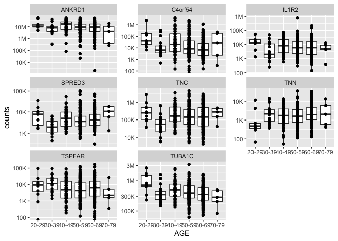<!-- -->


That completes our section on tidying and transforming data.

:::success

#### Key functions: Tidy and Transform

| Function         | Description                                                                                     |
|------------------|-------------------------------------------------------------------------------------------------|
| `filter()`       | A function for filtering data                                                                   |
| `mutate()`       | A function for create new columns                                                               |
| `select()`       | A function for selecting/reordering columns                                                     |
| `arrange()`      | A function for ordering observations                                                            |
| `full_join()`    | Join 2 tables, return all observations                                                          |
| `left_join()`    | Join 2 tables, return all observations in the left and matching observations in the right table |
| `inner_join()`   | Join 2 tables, return observations with values in both tables                                   |
| `pivot_wider()`  | Widen a data frame                                                                              |
| `pivot_longer()` | Lengthen a data frame                                                                           |
| `drop_na()`      | Remove missing values                                                                           |
| `separate()`     | Separate a column into two columns                                                              |

:::

## Communicate

Files for this workshop can be downloaded from GitHub at
<https://github.com/nih-cfde/training-rstudio-binder>. Specifically,
scripts and data are in the `GTEx` directory.

### References

-   [R for Data Science by Hadley Wickham and Garrett
    Grolemund](https://r4ds.had.co.nz/index.html)
-   [Rouillard et al. 2016. The Harmonizome: a collection of processed
    datasets gathered to serve and mine knowledge about genes and
    proteins. Database
    (Oxford).](http://database.oxfordjournals.org/content/2016/baw100.short)

### Additional Resources

-   [RStudio cheatsheet for
    readr](https://raw.githubusercontent.com/rstudio/cheatsheets/master/data-import.pdf)
-   [RStudio cheatsheet for
    dplyr](https://raw.githubusercontent.com/rstudio/cheatsheets/master/data-transformation.pdf)
-   [RStudio cheatsheet for data Wrangling with
    dplyr](https://www.rstudio.com/wp-content/uploads/2015/02/data-wrangling-cheatsheet.pdf)
-   [ggplot point
    shapes](http://www.sthda.com/english/wiki/ggplot2-point-shapes)
-   [Angus 2019 Intro to R
    Lesson](https://angus.readthedocs.io/en/2019/R_Intro_Lesson.html)
-   [Angus 2019 Differential Gene Expression in R
    Lesson](https://angus.readthedocs.io/en/2019/diff-ex-and-viz.html)
-   [Software Carpentry R
    Lesson](http://swcarpentry.github.io/r-novice-inflammation/)

*Note: the source document
[r4rnaseq-workshop.Rmd](https://github.com/nih-cfde/training-rstudio-binder/blob/data/GTEx/r4rnaseq-workshop.Rmd)
was last modified 3 May, 2022.*

------------------------------------------------------------------------

### Appendix

``` r
# Introduction


2 + 2 * 100
log10(0.05)


pval <- 0.05
pval

-log10(pval)


favorite_genes <- c("BRCA1", "JUN",  "GNRH1", "TH", "AR")
favorite_genes

#install.packages("ggplot2")


library(ggplot2)
library(tidyr)
library(dplyr)


# Import Data


samples <- read.csv("./data/samples.csv")

#View(samples)
head(samples)
tail(samples)
str(samples)
summary(samples)


counts <- read.csv("./data/countData.HEART.csv", row.names = 1)
dim(counts)
head(counts)[1:5]


results <- read.table("./data/GTEx_Heart_20-29_vs_50-59.tsv")
head(results)


dim(samples)


dplyr::count(samples, SMTS) 


head(dplyr::count(samples, SMTS, SEX))


head(dplyr::count(samples, SMTS, SEX, AGE, DTHHRDY ) )


# Visualize Data 


# Visualizing data with ggplot2

ggplot(samples, aes(x = SMTS)) +
  geom_bar(stat = "count")


ggplot(samples, aes(x = SMTS)) +
  geom_bar(stat = "count") + 
  coord_flip()


ggplot(samples, aes(x = SMTS, color = AGE)) +
  geom_bar(stat = "count") + 
  coord_flip()


ggplot(samples, aes(x = SMTS, fill = AGE)) +
  geom_bar(stat = "count") + 
  coord_flip()


ggplot(samples, aes(x = SMTS, fill = AGE)) +
  geom_bar(stat = "count") + 
  coord_flip() +
  facet_wrap(~SEX)


ggplot(results, aes(x = logFC, y = -log10(adj.P.Val))) +
  geom_point() 


ggplot(results, aes(x = logFC, y = -log10(adj.P.Val))) +
  geom_point() +
  geom_hline(yintercept = -log10(0.05))


ggplot(results, aes(x = logFC, y = -log10(adj.P.Val))) +
  geom_point(aes(color = ifelse( adj.P.Val < 0.05, "p < 0.05", "NS"))) +
  geom_hline(yintercept = -log10(0.05)) 


ggplot(results, aes(x = logFC, y = -log10(adj.P.Val))) +
  geom_point(aes(color = ifelse( adj.P.Val < 0.05, "p < 0.05", "NS"))) +
  geom_hline(yintercept = -log10(0.05))  +
  theme(legend.position = "bottom") +
  labs(color = "20-29 vs 50-59 year olds", 
       subtitle = "Heart Tissue Gene Expression")


ggplot(samples, aes(x = SMCENTER, y = SMRIN)) +
  geom_boxplot() +
  geom_jitter(aes(color = SMRIN))


# Wrangle (or Tidy and Tranform) Data


# Tidy and Transform Data

results %>% 
  filter(adj.P.Val < 0.05) %>% 
  head()


results %>% 
  filter(logFC > 1 | logFC < -1) %>%
  head()


results %>% filter(adj.P.Val < 0.05,
                   logFC > 1 | logFC < -1) %>%
  arrange(adj.P.Val) %>%
  head()


resultsDEGs <- results %>% filter(adj.P.Val < 0.05,
                   logFC > 1 | logFC < -1) %>%
  arrange(adj.P.Val) %>% 
  rownames(.)
resultsDEGs


colData <- read.csv("./data/colData.HEART.csv", row.names = 1)
head(colData)

head(rownames(colData) == colnames(counts))
head(colnames(counts))
head(rownames(colData))


colData_tidy <-  colData %>%
  mutate(SAMPID = gsub("-", ".", SAMPID))  
rownames(colData_tidy) <- colData_tidy$SAMPID

mycols <- rownames(colData_tidy)
head(mycols)


counts_tidy <- counts %>%
  select(all_of(mycols))

head(rownames(colData_tidy) == colnames(counts_tidy))


genes <- read.table("./data/ensembl_genes.tsv", sep = "\t",  header = T, fill = T)
head(genes)


resultsSymbol <- results %>%
  mutate(name = row.names(.))
head(resultsSymbol)


resultsName <- left_join(resultsSymbol, genes, by = "name")
head(resultsName)


resultsNameTidy <- resultsName %>%
  filter(adj.P.Val < 0.05,
                   logFC > 1 | logFC < -1) %>%
  arrange(adj.P.Val) %>%
  select(name, description, id, logFC, AveExpr, adj.P.Val)
head(resultsNameTidy)


resultsNameTidyIds <- resultsNameTidy %>%
  drop_na(id) %>%
  pull(id)
resultsNameTidyIds


counts_tidy_slim <- counts_tidy %>%
  mutate(id = row.names(.)) %>%
  filter(id %in% resultsNameTidyIds)
dim(counts_tidy_slim)
head(counts_tidy_slim)[1:5]
tail(counts_tidy_slim)[1:5]

counts_tidy_long <- counts_tidy_slim %>%
  pivot_longer(cols = all_of(mycols), names_to = "SAMPID", 
               values_to = "counts") 
head(counts_tidy_long)


counts_tidy_long_joined <- counts_tidy_long%>%
  inner_join(., colData_tidy, by = "SAMPID") %>%
  inner_join(., genes, by = "id") %>%
  arrange(desc(counts))
head(counts_tidy_long_joined)


library(scales)

counts_tidy_long_joined %>%
  ggplot(aes(x = AGE, y = counts)) +
  geom_boxplot() +
  geom_point() +
  facet_wrap(~name, scales = "free_y") +
  theme(axis.text.x = element_text(angle = 45, hjust  = 1),
        strip.text = element_text(face = "italic")) +
  scale_y_log10(labels = label_number_si()) 
```
