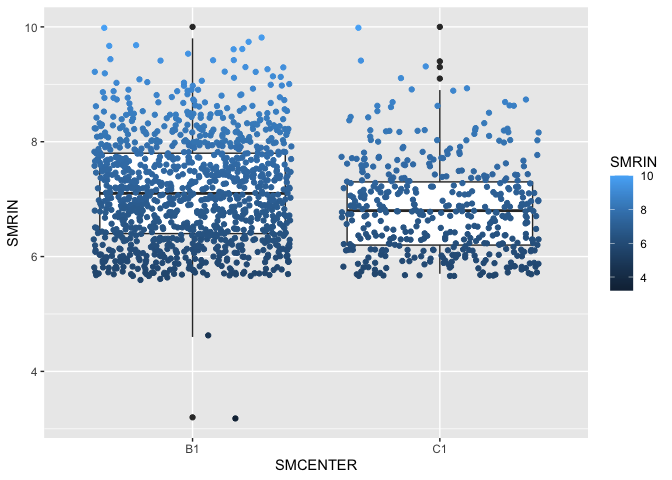

# Introduction to R for RNA-Seq Workshop

<!---

_Even though you can [](https://hackmd.io/2ArmQGwGT0uUyL5Ehqy0hQ), please make changes by editing [this .Rmd file](https://github.com/nih-cfde/training-rstudio-binder/blob/data/GTEx/r4rnaseq-workshop.Rmd)._

--->

**When:** Wednesday, April 27, 2022, 10 am - 12 pm PDT [workd
clock](https://www.timeanddate.com/worldclock/fixedtime.html?msg=+Introduction+to+R+for+RNA-Sequencing+Analysis&iso=20220427T10&p1=3736&ah=2)  
**Where:**
[Zoom](https://zoom.us/j/7575820324?pwd=d2UyMEhYZGNiV3kyUFpUL1EwQmthQT09)
and
[](https://mybinder.org/v2/gh/nih-cfde/training-rstudio-binder/data?urlpath=rstudio)  
**Instructors:** Dr. Rayna Harris  
**Organizer:** [The Common Fund Data
Ecosystem](https://training.nih-cfde.org/)

**Description:** RNA-Sequencing (RNA-Seq) is a popular method for
determining the presence and quantity of RNA in biological samples. In
this 2 hour workshop, we will use R to explore publicly-available
RNA-Seq data from the [Gene Expression Tissue Project
(GTEx)](https://gtexportal.org/home/). Attendees will be introduced to
the R syntax, variables, functions, packages, and data structures common
to RNA-Seq projects. We will use RStudio to import, tidy, transform, and
visualize RNA-Seq count data. Attendees will learn tips and tricks for
making the processes of data wrangling and data harmonization more
manageable. This workshop will not cover cloud-based workflows for
processing RNA-seq reads or statistics and modeling because these topics
are covered in our [RNA-Seq Concepts](https://osf.io/kj5av/) and
[RNA-Seq in the
Cloud](https://github.com/nih-cfde/rnaseq-in-the-cloud/blob/stable/rnaseq-workflow.pdf)
workshops. Rather, this workshop will focus on general R concepts
applied to RNA-Seq data. Familiarity with R is not required but would be
useful.


<div class="info">

### Learning Objectives

In this workshop, you will learn how to use R and RStudio to:

-   import and view files commonly associated with RNA-sequencing
    experiments
-   select variables and observations that are relevant to research
    questions (tidy)
-   create and rename variables (transform)
-   join data frames by common variables (harmonize)
-   visualize data using bar graphs, scatter plots, and box plots

You will produce graphs and tables to answer the of the following
motivating questions?

-   How many RNA-sequencing samples are in the GTEx project?
-   Do you have enough samples to test the effects of sex, age, hardy
    scale, and their interactions for all tissues?
-   What is the effect of age on gene expression in the heart?
-   How is my gene of interest affected by age in the heart and muscle?

</div>

## Introduction

The book [“R for Data Science”](https://r4ds.had.co.nz/index.html)
provides an excellent framework for using data science to turn raw data
into understanding, insight, and knowledge. We will use this framework
as an outline for this workshop.

**R** is a statistical computing and data visualization programming
language. **RStudio** is an integrated development environment, or IDE,
for R programming. R and RStudio work on Mac, Linux, and Windows
operating systems. The RStudio layout displays lots of useful
information and allows us to run R code from a script and view and save
outputs all from one interface.

When you start RStudio, you’ll see two key regions in the interface: the
console and the output. When working in R, you can type directly into
the console, or you can type into a script. Saving commands in a script
will make it easier to reproduce. You will learn more as we go along!


For today’s lesson, wef will focus on data from the [Gene-Tissue
Expression (GTEx) Project](https://commonfund.nih.gov/gtex). GTEx is an
ongoing effort to build a comprehensive public resource to study
tissue-specific gene expression and regulation. Samples were collected
from 54 non-diseased tissue sites across nearly 1000 individuals,
primarily for molecular assays including WGS, WES, and RNA-Seq.


### Getting Started

1.  Click the
    [](https://mybinder.org/v2/gh/nih-cfde/training-rstudio-binder/data?urlpath=rstudio)
    button to generate a computing environment for this workshop.
2.  Navigate to the GTEx folder.
3.  Click `GTEx.Rproj` and click “Yes” to open up an Rproject. This will
    set the working directory to `~/GTEx/`.
4.  If you open the `r4rnaseq-workshop.R` file which contains all the
    commands for today’s workshop, you can click through this and all
    the commands should run successfully.
5.  If you open a new R Script by clicking **File > New File > R
    Script**, you can code along by typing out all the commands for
    today’s lesson as I type them.

Click “Run” to send commands from a script to the console or click
command enter.

### R is a calculator

You can perform simple and advanced calculations in R.

``` r
2 + 2 * 100
```

    ## [1] 202

``` r
log(202)
```

    ## [1] 5.308268

You can save variable and recall them later.

``` r
pval <- 0.05
pval
```

    ## [1] 0.05

``` r
-log10(pval)
```

    ## [1] 1.30103

You can save really long lists of things with a short, descriptive names
that are easy to recall later.

``` r
favorite_genes <- c("BRCA1", "JUN",  "GNRH1", "TH", "AR")
favorite_genes
```

    ## [1] "BRCA1" "JUN"   "GNRH1" "TH"    "AR"

### Loading R packages

Many of the functions we will use are pre-installed. The
[Tidyverse](https://www.tidyverse.org/) is a collection of R packages
that include functions, data, and documentation that provide more tools
and capabilities when using R. You can install the popular data
visualization package `ggplot2` with the command
`install.packages("ggplot2")`). It is a good idea to “comment out” this
line of code by adding a `#` at the beginning so that you don’t
re-install the package every time you run the script. For this workshop,
the packages listed in the `.binder/environment.yml` file were
pre-installed with Conda.

``` r
#install.packages("ggplot2")
```

After installing packages, we need to load the functions and tools we
want to use from the package with the `library()` command. Let’s load
the `ggplot2` package.

``` r
library(ggplot2)
```

<div class="warning">

#### Challenge

We will also use functions from the packages `tidyr` and `dplyr` to tidy
and transform data. What command would you run to load these packages?

<div class="spoiler">

`library(tidyr)`  
`library(dplyr)`

</div>

You can also navigate to the “Packages” tab in the bottom right pane of
RStudio to view a list of available packages. Packages with a checked
box next to them have been successfully loaded. You can click a box to
load installed packages. Clicking the “Help” Tab will provide a quick
description of the package and its functions.

<div class="success">

#### Key functions

| Function             | Description                                  |
|----------------------|----------------------------------------------|
| `<-`                 | The assignment variable                      |
| `log10()`            | A built-in function for a log transformation |
| `install.packages()` | An R function to install packages            |
| `library()`          | The command used to load installed packages  |

</div>

## Importing and viewing data

Data can be imported using packages from base R or the tidyverse. What
are some differences between the data objects imported by base R
functions such as `read.csv()` and Tidyverse functions such as
`read_csv()`? To begin with, `read.csv()` replaces spaces and dashes
periods in column names, and it also preserves row.names. On the other
hand, `read_csv()` preserves spaces and dashes in column names but drops
row.names. For this workshop, we will use `read_csv()`, which means we
may have to replace dashes with periods so that our sample names in all
objects with sample name information.

Today, I will show you how to import the following files:

1.  data/samples.csv
2.  data/GTExHeart_20-29_vs_70-79.tsv
3.  data/colData.HEART.csv
4.  data/countData.HEART.csv.gz

Later, you can practice on your own using the following files:

1.  data/GTExMuscle_20-29_vs_70-79.tsv
2.  data/colData.MUSCLE.csv
3.  data/countData.MUSCLE.csv.gz

The `GTExPortal.csv` file in `./data/` contains information about all
the samples in the GTEx portal. Let’s import this file using
`read.csv()`.

``` r
samples <- read.csv("./data/samples.csv")
```

After importing a file, there are multiple ways to view the data.
`head()` to view the first few lines of each file. `names()` will print
just the column names. `str` will compactly displaying the internal
structure. `summary` will compute statistics.

``` r
View(samples)
head(samples)
```

    ##       SUBJID    SEX   AGE    DTHHRDY                   SAMPID           SMTS
    ## 1 GTEX-1117F Female 60-69 Slow death GTEX-1117F-0226-SM-5GZZ7 Adipose Tissue
    ## 2 GTEX-1117F Female 60-69 Slow death GTEX-1117F-0426-SM-5EGHI         Muscle
    ## 3 GTEX-1117F Female 60-69 Slow death GTEX-1117F-0526-SM-5EGHJ   Blood Vessel
    ## 4 GTEX-1117F Female 60-69 Slow death GTEX-1117F-0626-SM-5N9CS   Blood Vessel
    ## 5 GTEX-1117F Female 60-69 Slow death GTEX-1117F-0726-SM-5GIEN          Heart
    ## 6 GTEX-1117F Female 60-69 Slow death GTEX-1117F-1326-SM-5EGHH Adipose Tissue
    ##   SMNABTCH  SMNABTCHD SMGEBTCHT SMAFRZE SMCENTER SMRIN SMATSSCR
    ## 1 BP-43693 2013-09-17 TruSeq.v1  RNASEQ       B1   6.8        0
    ## 2 BP-43495 2013-09-12 TruSeq.v1  RNASEQ       B1   7.1        0
    ## 3 BP-43495 2013-09-12 TruSeq.v1  RNASEQ       B1   8.0        0
    ## 4 BP-43956 2013-09-25 TruSeq.v1  RNASEQ       B1   6.9        1
    ## 5 BP-44261 2013-10-03 TruSeq.v1  RNASEQ       B1   6.3        1
    ## 6 BP-43495 2013-09-12 TruSeq.v1  RNASEQ       B1   5.9        1

``` r
tail(samples)
```

    ##          SUBJID    SEX   AGE         DTHHRDY                   SAMPID
    ## 1479 GTEX-145ME Female 40-49 Ventilator Case GTEX-145ME-0926-SM-5O9AR
    ## 1480 GTEX-145ME Female 40-49 Ventilator Case GTEX-145ME-1026-SM-5O9B4
    ## 1481 GTEX-145ME Female 40-49 Ventilator Case GTEX-145ME-1126-SM-5SIAT
    ## 1482 GTEX-145ME Female 40-49 Ventilator Case GTEX-145ME-1226-SM-5SIB6
    ## 1483 GTEX-145ME Female 40-49 Ventilator Case GTEX-145ME-1326-SM-5O98Q
    ## 1484 GTEX-145ME Female 40-49 Ventilator Case GTEX-145ME-1426-SM-5RQJS
    ##                 SMTS SMNABTCH  SMNABTCHD SMGEBTCHT SMAFRZE SMCENTER SMRIN
    ## 1479 Small Intestine BP-47675 2013-12-19 TruSeq.v1  RNASEQ       B1   7.4
    ## 1480         Stomach BP-47675 2013-12-19 TruSeq.v1  RNASEQ       B1   7.4
    ## 1481           Colon BP-47616 2013-12-18 TruSeq.v1  RNASEQ       B1   6.9
    ## 1482           Ovary BP-47616 2013-12-18 TruSeq.v1  RNASEQ       B1   7.3
    ## 1483          Uterus BP-47675 2013-12-19 TruSeq.v1  RNASEQ       B1   8.5
    ## 1484          Vagina BP-48437 2014-01-17 TruSeq.v1  RNASEQ       B1   7.2
    ##      SMATSSCR
    ## 1479        1
    ## 1480        1
    ## 1481        1
    ## 1482        1
    ## 1483        1
    ## 1484        1

``` r
str(samples)
```

    ## 'data.frame':    1484 obs. of  13 variables:
    ##  $ SUBJID   : chr  "GTEX-1117F" "GTEX-1117F" "GTEX-1117F" "GTEX-1117F" ...
    ##  $ SEX      : chr  "Female" "Female" "Female" "Female" ...
    ##  $ AGE      : chr  "60-69" "60-69" "60-69" "60-69" ...
    ##  $ DTHHRDY  : chr  "Slow death" "Slow death" "Slow death" "Slow death" ...
    ##  $ SAMPID   : chr  "GTEX-1117F-0226-SM-5GZZ7" "GTEX-1117F-0426-SM-5EGHI" "GTEX-1117F-0526-SM-5EGHJ" "GTEX-1117F-0626-SM-5N9CS" ...
    ##  $ SMTS     : chr  "Adipose Tissue" "Muscle" "Blood Vessel" "Blood Vessel" ...
    ##  $ SMNABTCH : chr  "BP-43693" "BP-43495" "BP-43495" "BP-43956" ...
    ##  $ SMNABTCHD: chr  "2013-09-17" "2013-09-12" "2013-09-12" "2013-09-25" ...
    ##  $ SMGEBTCHT: chr  "TruSeq.v1" "TruSeq.v1" "TruSeq.v1" "TruSeq.v1" ...
    ##  $ SMAFRZE  : chr  "RNASEQ" "RNASEQ" "RNASEQ" "RNASEQ" ...
    ##  $ SMCENTER : chr  "B1" "B1" "B1" "B1" ...
    ##  $ SMRIN    : num  6.8 7.1 8 6.9 6.3 5.9 6.6 6.3 6.5 5.8 ...
    ##  $ SMATSSCR : int  0 0 0 1 1 1 1 1 2 1 ...

``` r
summary(samples)
```

    ##     SUBJID              SEX                AGE              DTHHRDY         
    ##  Length:1484        Length:1484        Length:1484        Length:1484       
    ##  Class :character   Class :character   Class :character   Class :character  
    ##  Mode  :character   Mode  :character   Mode  :character   Mode  :character  
    ##                                                                             
    ##                                                                             
    ##                                                                             
    ##     SAMPID              SMTS             SMNABTCH          SMNABTCHD        
    ##  Length:1484        Length:1484        Length:1484        Length:1484       
    ##  Class :character   Class :character   Class :character   Class :character  
    ##  Mode  :character   Mode  :character   Mode  :character   Mode  :character  
    ##                                                                             
    ##                                                                             
    ##                                                                             
    ##   SMGEBTCHT           SMAFRZE            SMCENTER             SMRIN       
    ##  Length:1484        Length:1484        Length:1484        Min.   : 3.200  
    ##  Class :character   Class :character   Class :character   1st Qu.: 6.300  
    ##  Mode  :character   Mode  :character   Mode  :character   Median : 7.000  
    ##                                                           Mean   : 7.061  
    ##                                                           3rd Qu.: 7.700  
    ##                                                           Max.   :10.000  
    ##     SMATSSCR     
    ##  Min.   :0.0000  
    ##  1st Qu.:0.0000  
    ##  Median :1.0000  
    ##  Mean   :0.8491  
    ##  3rd Qu.:1.0000  
    ##  Max.   :3.0000

Count files can be very long and wide, so it is a good idea to only view
the first (or last) few rows and columns. Typically, a gene identifier
(like an ensemble id) will be used as the row names. We can use `dim` to
see how many rows and columns are in the file.

``` r
counts <- read.csv("./data/countData.HEART.csv", row.names = 1)
dim(counts)
```

    ## [1] 63856   306

``` r
head(counts)[1:5]
```

    ##                 GTEX.12ZZX.0726.SM.5EGKA GTEX.13D11.1526.SM.5J2NA
    ## ENSG00000278704                        0                        0
    ## ENSG00000277400                        0                        0
    ## ENSG00000274847                        0                        0
    ## ENSG00000277428                        0                        0
    ## ENSG00000276256                        0                        0
    ## ENSG00000278198                        0                        0
    ##                 GTEX.ZAJG.0826.SM.5PNVA GTEX.11TT1.1426.SM.5EGIA
    ## ENSG00000278704                       0                        0
    ## ENSG00000277400                       0                        0
    ## ENSG00000274847                       0                        0
    ## ENSG00000277428                       0                        0
    ## ENSG00000276256                       0                        0
    ## ENSG00000278198                       0                        0
    ##                 GTEX.13VXT.1126.SM.5LU3A
    ## ENSG00000278704                        0
    ## ENSG00000277400                        0
    ## ENSG00000274847                        0
    ## ENSG00000277428                        0
    ## ENSG00000276256                        0
    ## ENSG00000278198                        0

This “countData” was generated by using `recount3` as described in the
file `scripts/recount3.Rmd`. It comes from a Ranged Summarized
Experiment (rse) which contains quantitative information about read
counts as well as quality control information and sample descriptions.
The “colData” from an rse can also be obtained. This information
*should* match the information in our samples file, but there can be
subtle differences in formatting We will read the colData in a later
section.

Very large tabular files are often saved as .tsv files. These can be
imported with `read.table()` or `read_tsv()`. You can also specify the
tab delimiter as well as the row and column names. You can import files
using the default parameters or you can change them. Because the first
column in the .tsv files does not have a row name, by default,
`read.table()`, imports the first column as the row.names. When
`sep = "\t", header = TRUE` is specified, the fist column is imported as
column one and given the column name `X`.

``` r
# with row.names
results <- read.table("./data/GTEx_Heart_20-29_vs_50-59.tsv")
head(results)
```

    ##               logFC    AveExpr         t    P.Value adj.P.Val         B
    ## A1BG     0.67408600  1.6404652 2.1740238 0.03283291 0.1536518 -3.617093
    ## A1BG-AS1 0.23168690 -0.1864802 1.0403316 0.30150123 0.5316030 -4.984225
    ## A2M      0.02453974  9.8251848 0.1948624 0.84602333 0.9215696 -5.783835
    ## A2M-AS1  0.38115436  2.4535892 2.4839630 0.01520646 0.1033370 -3.067127
    ## A2ML1    0.58865741 -1.0412696 1.8263856 0.07173966 0.2328150 -4.065276
    ## A2MP1    0.31631081 -0.8994146 1.4061454 0.16377753 0.3730822 -4.583435

<div class="warning">

#### Challenge

What commands could you use to read the following files: 1. GTEx results
comparing the muscles of 20-29 year old to 70-79 year olds? 1. The csv
file information describing the muscle samples?

<div class="spoiler">

1.  `read.table("./data/GTEx_Muscle_20-29_vs_70-79.tsv")`
2.  `read.csv("./data/countData.MUSCLE.csv", row.names = 1)`

</div>

#### Quick summary statistics and sample size

You have now seen a variety of options for importing files. You may use
many more in your R-based RNA-seq workflow, but these basics will get
you started. Let’s now explore the functions `summary()`, `length()`,
`dim()`, and `count()` us to quickly summarize and compare data frames
to answer the following questions.

How many samples do we have? Over 1400!

``` r
dim(samples)
```

    ## [1] 1484   13

How many samples are there per tissue?

``` r
dplyr::count(samples, SMTS) 
```

    ##               SMTS   n
    ## 1   Adipose Tissue 133
    ## 2    Adrenal Gland  20
    ## 3     Blood Vessel 138
    ## 4            Brain  75
    ## 5           Breast  50
    ## 6            Colon  77
    ## 7        Esophagus 143
    ## 8            Heart  99
    ## 9           Kidney   6
    ## 10           Liver  28
    ## 11            Lung  67
    ## 12          Muscle  96
    ## 13           Nerve  70
    ## 14           Ovary  16
    ## 15        Pancreas  30
    ## 16       Pituitary  37
    ## 17        Prostate  24
    ## 18  Salivary Gland  22
    ## 19            Skin 155
    ## 20 Small Intestine  23
    ## 21          Spleen  16
    ## 22         Stomach  29
    ## 23          Testis  37
    ## 24         Thyroid  68
    ## 25          Uterus  14
    ## 26          Vagina  11

How many samples are there per tissue and sex? Can we test the effect of
sex on gene expression in all tissues? For many samples, yes, but not
all tissues were samples from both males and females.

``` r
dplyr::count(samples, SMTS, SEX) 
```

    ##               SMTS    SEX   n
    ## 1   Adipose Tissue Female  40
    ## 2   Adipose Tissue   Male  93
    ## 3    Adrenal Gland Female   7
    ## 4    Adrenal Gland   Male  13
    ## 5     Blood Vessel Female  48
    ## 6     Blood Vessel   Male  90
    ## 7            Brain Female  23
    ## 8            Brain   Male  52
    ## 9           Breast Female  16
    ## 10          Breast   Male  34
    ## 11           Colon Female  25
    ## 12           Colon   Male  52
    ## 13       Esophagus Female  37
    ## 14       Esophagus   Male 106
    ## 15           Heart Female  30
    ## 16           Heart   Male  69
    ## 17          Kidney Female   1
    ## 18          Kidney   Male   5
    ## 19           Liver Female   4
    ## 20           Liver   Male  24
    ## 21            Lung Female  20
    ## 22            Lung   Male  47
    ## 23          Muscle Female  25
    ## 24          Muscle   Male  71
    ## 25           Nerve Female  19
    ## 26           Nerve   Male  51
    ## 27           Ovary Female  16
    ## 28        Pancreas Female  12
    ## 29        Pancreas   Male  18
    ## 30       Pituitary Female  10
    ## 31       Pituitary   Male  27
    ## 32        Prostate   Male  24
    ## 33  Salivary Gland Female   5
    ## 34  Salivary Gland   Male  17
    ## 35            Skin Female  47
    ## 36            Skin   Male 108
    ## 37 Small Intestine Female   8
    ## 38 Small Intestine   Male  15
    ## 39          Spleen Female   8
    ## 40          Spleen   Male   8
    ## 41         Stomach Female   9
    ## 42         Stomach   Male  20
    ## 43          Testis   Male  37
    ## 44         Thyroid Female  17
    ## 45         Thyroid   Male  51
    ## 46          Uterus Female  14
    ## 47          Vagina Female  11

How many samples are there per sex, age, and hardy scale? Do you have
enough samples to test the effects of Sex, Age, and Hardy Scale in the
Heart?

``` r
dplyr::count(samples, SMTS, SEX, AGE, DTHHRDY ) 
```

    ##                SMTS    SEX   AGE                      DTHHRDY  n
    ## 1    Adipose Tissue Female 20-29              Ventilator Case  3
    ## 2    Adipose Tissue Female 30-39              Ventilator Case  2
    ## 3    Adipose Tissue Female 40-49 Fast death of natural causes  1
    ## 4    Adipose Tissue Female 40-49              Ventilator Case  5
    ## 5    Adipose Tissue Female 40-49       Violent and fast death  2
    ## 6    Adipose Tissue Female 50-59 Fast death of natural causes  3
    ## 7    Adipose Tissue Female 50-59                   Slow death  1
    ## 8    Adipose Tissue Female 50-59              Ventilator Case  8
    ## 9    Adipose Tissue Female 60-69 Fast death of natural causes  3
    ## 10   Adipose Tissue Female 60-69                   Slow death  7
    ## 11   Adipose Tissue Female 60-69              Ventilator Case  5
    ## 12   Adipose Tissue   Male 20-29              Ventilator Case  7
    ## 13   Adipose Tissue   Male 20-29       Violent and fast death  2
    ## 14   Adipose Tissue   Male 30-39              Ventilator Case  6
    ## 15   Adipose Tissue   Male 40-49 Fast death of natural causes  1
    ## 16   Adipose Tissue   Male 40-49              Ventilator Case  5
    ## 17   Adipose Tissue   Male 50-59 Fast death of natural causes 13
    ## 18   Adipose Tissue   Male 50-59                   Slow death  4
    ## 19   Adipose Tissue   Male 50-59              Ventilator Case 14
    ## 20   Adipose Tissue   Male 60-69 Fast death of natural causes 16
    ## 21   Adipose Tissue   Male 60-69           Intermediate death  3
    ## 22   Adipose Tissue   Male 60-69                   Slow death  6
    ## 23   Adipose Tissue   Male 60-69              Ventilator Case 10
    ## 24   Adipose Tissue   Male 60-69       Violent and fast death  1
    ## 25   Adipose Tissue   Male 70-79 Fast death of natural causes  1
    ## 26   Adipose Tissue   Male 70-79                   Slow death  2
    ## 27   Adipose Tissue   Male 70-79              Ventilator Case  2
    ## 28    Adrenal Gland Female 50-59              Ventilator Case  4
    ## 29    Adrenal Gland Female 60-69           Intermediate death  1
    ## 30    Adrenal Gland Female 60-69              Ventilator Case  2
    ## 31    Adrenal Gland   Male 20-29              Ventilator Case  1
    ## 32    Adrenal Gland   Male 30-39              Ventilator Case  1
    ## 33    Adrenal Gland   Male 40-49              Ventilator Case  3
    ## 34    Adrenal Gland   Male 50-59 Fast death of natural causes  1
    ## 35    Adrenal Gland   Male 50-59              Ventilator Case  3
    ## 36    Adrenal Gland   Male 60-69 Fast death of natural causes  1
    ## 37    Adrenal Gland   Male 60-69              Ventilator Case  3
    ## 38     Blood Vessel Female 20-29              Ventilator Case  5
    ## 39     Blood Vessel Female 30-39              Ventilator Case  2
    ## 40     Blood Vessel Female 40-49 Fast death of natural causes  1
    ## 41     Blood Vessel Female 40-49              Ventilator Case  4
    ## 42     Blood Vessel Female 40-49       Violent and fast death  3
    ## 43     Blood Vessel Female 50-59 Fast death of natural causes  1
    ## 44     Blood Vessel Female 50-59                   Slow death  2
    ## 45     Blood Vessel Female 50-59              Ventilator Case 11
    ## 46     Blood Vessel Female 60-69 Fast death of natural causes  4
    ## 47     Blood Vessel Female 60-69           Intermediate death  2
    ## 48     Blood Vessel Female 60-69                   Slow death  6
    ## 49     Blood Vessel Female 60-69              Ventilator Case  7
    ## 50     Blood Vessel   Male 20-29              Ventilator Case  8
    ## 51     Blood Vessel   Male 20-29       Violent and fast death  1
    ## 52     Blood Vessel   Male 30-39              Ventilator Case  5
    ## 53     Blood Vessel   Male 40-49 Fast death of natural causes  3
    ## 54     Blood Vessel   Male 40-49                   Slow death  1
    ## 55     Blood Vessel   Male 40-49              Ventilator Case  6
    ## 56     Blood Vessel   Male 50-59 Fast death of natural causes  9
    ## 57     Blood Vessel   Male 50-59                   Slow death  5
    ## 58     Blood Vessel   Male 50-59              Ventilator Case 13
    ## 59     Blood Vessel   Male 60-69 Fast death of natural causes 17
    ## 60     Blood Vessel   Male 60-69           Intermediate death  2
    ## 61     Blood Vessel   Male 60-69                   Slow death  4
    ## 62     Blood Vessel   Male 60-69              Ventilator Case 13
    ## 63     Blood Vessel   Male 70-79 Fast death of natural causes  2
    ## 64     Blood Vessel   Male 70-79              Ventilator Case  1
    ## 65            Brain Female 40-49              Ventilator Case  2
    ## 66            Brain Female 40-49       Violent and fast death  2
    ## 67            Brain Female 50-59 Fast death of natural causes  4
    ## 68            Brain Female 50-59                   Slow death  1
    ## 69            Brain Female 60-69 Fast death of natural causes  4
    ## 70            Brain Female 60-69           Intermediate death  2
    ## 71            Brain Female 60-69                   Slow death  8
    ## 72            Brain   Male 40-49 Fast death of natural causes  4
    ## 73            Brain   Male 50-59 Fast death of natural causes 17
    ## 74            Brain   Male 50-59                   Slow death  3
    ## 75            Brain   Male 60-69 Fast death of natural causes 20
    ## 76            Brain   Male 60-69           Intermediate death  1
    ## 77            Brain   Male 60-69                   Slow death  4
    ## 78            Brain   Male 60-69              Ventilator Case  2
    ## 79            Brain   Male 70-79                   Slow death  1
    ## 80           Breast Female 20-29              Ventilator Case  1
    ## 81           Breast Female 30-39              Ventilator Case  1
    ## 82           Breast Female 40-49 Fast death of natural causes  1
    ## 83           Breast Female 40-49       Violent and fast death  1
    ## 84           Breast Female 50-59 Fast death of natural causes  2
    ## 85           Breast Female 50-59                   Slow death  1
    ## 86           Breast Female 50-59              Ventilator Case  2
    ## 87           Breast Female 60-69 Fast death of natural causes  1
    ## 88           Breast Female 60-69           Intermediate death  1
    ## 89           Breast Female 60-69                   Slow death  2
    ## 90           Breast Female 60-69              Ventilator Case  3
    ## 91           Breast   Male 20-29              Ventilator Case  2
    ## 92           Breast   Male 20-29       Violent and fast death  1
    ## 93           Breast   Male 30-39              Ventilator Case  4
    ## 94           Breast   Male 40-49 Fast death of natural causes  1
    ## 95           Breast   Male 40-49              Ventilator Case  4
    ## 96           Breast   Male 50-59 Fast death of natural causes  4
    ## 97           Breast   Male 50-59                   Slow death  1
    ## 98           Breast   Male 50-59              Ventilator Case  4
    ## 99           Breast   Male 60-69 Fast death of natural causes  6
    ## 100          Breast   Male 60-69           Intermediate death  1
    ## 101          Breast   Male 60-69                   Slow death  1
    ## 102          Breast   Male 60-69              Ventilator Case  3
    ## 103          Breast   Male 70-79 Fast death of natural causes  1
    ## 104          Breast   Male 70-79              Ventilator Case  1
    ## 105           Colon Female 20-29              Ventilator Case  2
    ## 106           Colon Female 30-39              Ventilator Case  2
    ## 107           Colon Female 40-49              Ventilator Case  4
    ## 108           Colon Female 40-49       Violent and fast death  1
    ## 109           Colon Female 50-59              Ventilator Case  7
    ## 110           Colon Female 60-69           Intermediate death  1
    ## 111           Colon Female 60-69                   Slow death  4
    ## 112           Colon Female 60-69              Ventilator Case  4
    ## 113           Colon   Male 20-29              Ventilator Case  5
    ## 114           Colon   Male 20-29       Violent and fast death  2
    ## 115           Colon   Male 30-39              Ventilator Case  2
    ## 116           Colon   Male 40-49 Fast death of natural causes  1
    ## 117           Colon   Male 40-49              Ventilator Case  5
    ## 118           Colon   Male 50-59 Fast death of natural causes  3
    ## 119           Colon   Male 50-59                   Slow death  3
    ## 120           Colon   Male 50-59              Ventilator Case  9
    ## 121           Colon   Male 60-69 Fast death of natural causes 13
    ## 122           Colon   Male 60-69                   Slow death  2
    ## 123           Colon   Male 60-69              Ventilator Case  6
    ## 124           Colon   Male 70-79 Fast death of natural causes  1
    ## 125       Esophagus Female 20-29              Ventilator Case  2
    ## 126       Esophagus Female 30-39              Ventilator Case  3
    ## 127       Esophagus Female 40-49              Ventilator Case  6
    ## 128       Esophagus Female 40-49       Violent and fast death  1
    ## 129       Esophagus Female 50-59 Fast death of natural causes  2
    ## 130       Esophagus Female 50-59              Ventilator Case 13
    ## 131       Esophagus Female 60-69                   Slow death  4
    ## 132       Esophagus Female 60-69              Ventilator Case  6
    ## 133       Esophagus   Male 20-29              Ventilator Case 12
    ## 134       Esophagus   Male 20-29       Violent and fast death  3
    ## 135       Esophagus   Male 30-39              Ventilator Case  5
    ## 136       Esophagus   Male 40-49 Fast death of natural causes  5
    ## 137       Esophagus   Male 40-49              Ventilator Case  9
    ## 138       Esophagus   Male 50-59 Fast death of natural causes 11
    ## 139       Esophagus   Male 50-59                   Slow death  6
    ## 140       Esophagus   Male 50-59              Ventilator Case 19
    ## 141       Esophagus   Male 60-69 Fast death of natural causes 13
    ## 142       Esophagus   Male 60-69           Intermediate death  2
    ## 143       Esophagus   Male 60-69                   Slow death  3
    ## 144       Esophagus   Male 60-69              Ventilator Case 17
    ## 145       Esophagus   Male 70-79              Ventilator Case  1
    ## 146           Heart Female 20-29              Ventilator Case  2
    ## 147           Heart Female 30-39              Ventilator Case  1
    ## 148           Heart Female 40-49              Ventilator Case  3
    ## 149           Heart Female 40-49       Violent and fast death  1
    ## 150           Heart Female 50-59 Fast death of natural causes  4
    ## 151           Heart Female 50-59              Ventilator Case  9
    ## 152           Heart Female 60-69           Intermediate death  2
    ## 153           Heart Female 60-69                   Slow death  4
    ## 154           Heart Female 60-69              Ventilator Case  4
    ## 155           Heart   Male 20-29              Ventilator Case  2
    ## 156           Heart   Male 30-39              Ventilator Case  3
    ## 157           Heart   Male 40-49 Fast death of natural causes  4
    ## 158           Heart   Male 40-49              Ventilator Case  5
    ## 159           Heart   Male 50-59 Fast death of natural causes  6
    ## 160           Heart   Male 50-59                   Slow death  5
    ## 161           Heart   Male 50-59              Ventilator Case  9
    ## 162           Heart   Male 60-69 Fast death of natural causes 15
    ## 163           Heart   Male 60-69           Intermediate death  2
    ## 164           Heart   Male 60-69                   Slow death  4
    ## 165           Heart   Male 60-69              Ventilator Case 11
    ## 166           Heart   Male 70-79 Fast death of natural causes  1
    ## 167           Heart   Male 70-79              Ventilator Case  2
    ## 168          Kidney Female 60-69                   Slow death  1
    ## 169          Kidney   Male 40-49 Fast death of natural causes  1
    ## 170          Kidney   Male 50-59 Fast death of natural causes  1
    ## 171          Kidney   Male 60-69 Fast death of natural causes  2
    ## 172          Kidney   Male 60-69                   Slow death  1
    ## 173           Liver Female 50-59 Fast death of natural causes  1
    ## 174           Liver Female 50-59              Ventilator Case  1
    ## 175           Liver Female 60-69 Fast death of natural causes  1
    ## 176           Liver Female 60-69           Intermediate death  1
    ## 177           Liver   Male 20-29              Ventilator Case  2
    ## 178           Liver   Male 30-39              Ventilator Case  1
    ## 179           Liver   Male 40-49 Fast death of natural causes  1
    ## 180           Liver   Male 40-49              Ventilator Case  1
    ## 181           Liver   Male 50-59 Fast death of natural causes  6
    ## 182           Liver   Male 50-59              Ventilator Case  3
    ## 183           Liver   Male 60-69 Fast death of natural causes  9
    ## 184           Liver   Male 60-69           Intermediate death  1
    ## 185            Lung Female 20-29              Ventilator Case  2
    ## 186            Lung Female 30-39              Ventilator Case  1
    ## 187            Lung Female 40-49 Fast death of natural causes  1
    ## 188            Lung Female 40-49              Ventilator Case  3
    ## 189            Lung Female 50-59 Fast death of natural causes  1
    ## 190            Lung Female 50-59                   Slow death  1
    ## 191            Lung Female 50-59              Ventilator Case  3
    ## 192            Lung Female 60-69 Fast death of natural causes  2
    ## 193            Lung Female 60-69           Intermediate death  1
    ## 194            Lung Female 60-69                   Slow death  3
    ## 195            Lung Female 60-69              Ventilator Case  2
    ## 196            Lung   Male 20-29              Ventilator Case  2
    ## 197            Lung   Male 30-39              Ventilator Case  2
    ## 198            Lung   Male 40-49 Fast death of natural causes  2
    ## 199            Lung   Male 40-49              Ventilator Case  3
    ## 200            Lung   Male 50-59 Fast death of natural causes  6
    ## 201            Lung   Male 50-59                   Slow death  3
    ## 202            Lung   Male 50-59              Ventilator Case  7
    ## 203            Lung   Male 60-69 Fast death of natural causes 10
    ## 204            Lung   Male 60-69                   Slow death  3
    ## 205            Lung   Male 60-69              Ventilator Case  6
    ## 206            Lung   Male 70-79 Fast death of natural causes  2
    ## 207            Lung   Male 70-79              Ventilator Case  1
    ## 208          Muscle Female 20-29              Ventilator Case  2
    ## 209          Muscle Female 30-39              Ventilator Case  1
    ## 210          Muscle Female 40-49 Fast death of natural causes  1
    ## 211          Muscle Female 40-49              Ventilator Case  2
    ## 212          Muscle Female 40-49       Violent and fast death  1
    ## 213          Muscle Female 50-59 Fast death of natural causes  2
    ## 214          Muscle Female 50-59                   Slow death  1
    ## 215          Muscle Female 50-59              Ventilator Case  5
    ## 216          Muscle Female 60-69 Fast death of natural causes  2
    ## 217          Muscle Female 60-69           Intermediate death  1
    ## 218          Muscle Female 60-69                   Slow death  5
    ## 219          Muscle Female 60-69              Ventilator Case  2
    ## 220          Muscle   Male 20-29              Ventilator Case  4
    ## 221          Muscle   Male 20-29       Violent and fast death  1
    ## 222          Muscle   Male 30-39              Ventilator Case  4
    ## 223          Muscle   Male 40-49 Fast death of natural causes  2
    ## 224          Muscle   Male 40-49                   Slow death  1
    ## 225          Muscle   Male 40-49              Ventilator Case  4
    ## 226          Muscle   Male 50-59 Fast death of natural causes  9
    ## 227          Muscle   Male 50-59                   Slow death  2
    ## 228          Muscle   Male 50-59              Ventilator Case 10
    ## 229          Muscle   Male 60-69 Fast death of natural causes 16
    ## 230          Muscle   Male 60-69           Intermediate death  2
    ## 231          Muscle   Male 60-69                   Slow death  5
    ## 232          Muscle   Male 60-69              Ventilator Case  6
    ## 233          Muscle   Male 60-69       Violent and fast death  1
    ## 234          Muscle   Male 70-79 Fast death of natural causes  2
    ## 235          Muscle   Male 70-79                   Slow death  1
    ## 236          Muscle   Male 70-79              Ventilator Case  1
    ## 237           Nerve Female 20-29              Ventilator Case  1
    ## 238           Nerve Female 30-39              Ventilator Case  1
    ## 239           Nerve Female 40-49 Fast death of natural causes  1
    ## 240           Nerve Female 40-49              Ventilator Case  1
    ## 241           Nerve Female 40-49       Violent and fast death  1
    ## 242           Nerve Female 50-59 Fast death of natural causes  2
    ## 243           Nerve Female 50-59                   Slow death  1
    ## 244           Nerve Female 50-59              Ventilator Case  4
    ## 245           Nerve Female 60-69 Fast death of natural causes  2
    ## 246           Nerve Female 60-69           Intermediate death  1
    ## 247           Nerve Female 60-69                   Slow death  2
    ## 248           Nerve Female 60-69              Ventilator Case  2
    ## 249           Nerve   Male 20-29              Ventilator Case  3
    ## 250           Nerve   Male 20-29       Violent and fast death  1
    ## 251           Nerve   Male 30-39              Ventilator Case  2
    ## 252           Nerve   Male 40-49 Fast death of natural causes  1
    ## 253           Nerve   Male 40-49              Ventilator Case  2
    ## 254           Nerve   Male 50-59 Fast death of natural causes  9
    ## 255           Nerve   Male 50-59                   Slow death  2
    ## 256           Nerve   Male 50-59              Ventilator Case  9
    ## 257           Nerve   Male 60-69 Fast death of natural causes 10
    ## 258           Nerve   Male 60-69           Intermediate death  1
    ## 259           Nerve   Male 60-69                   Slow death  3
    ## 260           Nerve   Male 60-69              Ventilator Case  6
    ## 261           Nerve   Male 70-79                   Slow death  1
    ## 262           Nerve   Male 70-79              Ventilator Case  1
    ## 263           Ovary Female 20-29              Ventilator Case  2
    ## 264           Ovary Female 30-39              Ventilator Case  1
    ## 265           Ovary Female 40-49              Ventilator Case  2
    ## 266           Ovary Female 40-49       Violent and fast death  1
    ## 267           Ovary Female 50-59 Fast death of natural causes  2
    ## 268           Ovary Female 50-59              Ventilator Case  4
    ## 269           Ovary Female 60-69           Intermediate death  1
    ## 270           Ovary Female 60-69                   Slow death  2
    ## 271           Ovary Female 60-69              Ventilator Case  1
    ## 272        Pancreas Female 20-29              Ventilator Case  2
    ## 273        Pancreas Female 40-49              Ventilator Case  2
    ## 274        Pancreas Female 50-59 Fast death of natural causes  1
    ## 275        Pancreas Female 50-59              Ventilator Case  5
    ## 276        Pancreas Female 60-69              Ventilator Case  2
    ## 277        Pancreas   Male 20-29              Ventilator Case  2
    ## 278        Pancreas   Male 30-39              Ventilator Case  1
    ## 279        Pancreas   Male 40-49              Ventilator Case  2
    ## 280        Pancreas   Male 50-59 Fast death of natural causes  2
    ## 281        Pancreas   Male 50-59              Ventilator Case  4
    ## 282        Pancreas   Male 60-69 Fast death of natural causes  3
    ## 283        Pancreas   Male 60-69              Ventilator Case  4
    ## 284       Pituitary Female 40-49 Fast death of natural causes  1
    ## 285       Pituitary Female 40-49              Ventilator Case  1
    ## 286       Pituitary Female 40-49       Violent and fast death  1
    ## 287       Pituitary Female 50-59 Fast death of natural causes  2
    ## 288       Pituitary Female 50-59                   Slow death  1
    ## 289       Pituitary Female 60-69 Fast death of natural causes  2
    ## 290       Pituitary Female 60-69                   Slow death  2
    ## 291       Pituitary   Male 40-49 Fast death of natural causes  1
    ## 292       Pituitary   Male 50-59 Fast death of natural causes  4
    ## 293       Pituitary   Male 50-59                   Slow death  2
    ## 294       Pituitary   Male 60-69 Fast death of natural causes 13
    ## 295       Pituitary   Male 60-69           Intermediate death  1
    ## 296       Pituitary   Male 60-69                   Slow death  2
    ## 297       Pituitary   Male 60-69              Ventilator Case  1
    ## 298       Pituitary   Male 70-79 Fast death of natural causes  1
    ## 299       Pituitary   Male 70-79                   Slow death  1
    ## 300       Pituitary   Male 70-79              Ventilator Case  1
    ## 301        Prostate   Male 20-29              Ventilator Case  3
    ## 302        Prostate   Male 20-29       Violent and fast death  1
    ## 303        Prostate   Male 30-39              Ventilator Case  1
    ## 304        Prostate   Male 40-49 Fast death of natural causes  1
    ## 305        Prostate   Male 40-49              Ventilator Case  2
    ## 306        Prostate   Male 50-59 Fast death of natural causes  2
    ## 307        Prostate   Male 50-59              Ventilator Case  4
    ## 308        Prostate   Male 60-69 Fast death of natural causes  4
    ## 309        Prostate   Male 60-69                   Slow death  2
    ## 310        Prostate   Male 60-69              Ventilator Case  4
    ## 311  Salivary Gland Female 20-29              Ventilator Case  1
    ## 312  Salivary Gland Female 30-39              Ventilator Case  1
    ## 313  Salivary Gland Female 60-69 Fast death of natural causes  1
    ## 314  Salivary Gland Female 60-69                   Slow death  1
    ## 315  Salivary Gland Female 60-69              Ventilator Case  1
    ## 316  Salivary Gland   Male 20-29       Violent and fast death  1
    ## 317  Salivary Gland   Male 30-39              Ventilator Case  1
    ## 318  Salivary Gland   Male 40-49 Fast death of natural causes  1
    ## 319  Salivary Gland   Male 40-49              Ventilator Case  1
    ## 320  Salivary Gland   Male 50-59 Fast death of natural causes  2
    ## 321  Salivary Gland   Male 50-59              Ventilator Case  1
    ## 322  Salivary Gland   Male 60-69 Fast death of natural causes  7
    ## 323  Salivary Gland   Male 60-69           Intermediate death  1
    ## 324  Salivary Gland   Male 60-69              Ventilator Case  2
    ## 325            Skin Female 20-29              Ventilator Case  4
    ## 326            Skin Female 30-39              Ventilator Case  2
    ## 327            Skin Female 40-49 Fast death of natural causes  2
    ## 328            Skin Female 40-49              Ventilator Case  4
    ## 329            Skin Female 40-49       Violent and fast death  2
    ## 330            Skin Female 50-59 Fast death of natural causes  4
    ## 331            Skin Female 50-59                   Slow death  2
    ## 332            Skin Female 50-59              Ventilator Case 10
    ## 333            Skin Female 60-69 Fast death of natural causes  3
    ## 334            Skin Female 60-69           Intermediate death  2
    ## 335            Skin Female 60-69                   Slow death  7
    ## 336            Skin Female 60-69              Ventilator Case  5
    ## 337            Skin   Male 20-29              Ventilator Case  6
    ## 338            Skin   Male 20-29       Violent and fast death  2
    ## 339            Skin   Male 30-39              Ventilator Case  6
    ## 340            Skin   Male 40-49 Fast death of natural causes  4
    ## 341            Skin   Male 40-49                   Slow death  1
    ## 342            Skin   Male 40-49              Ventilator Case  6
    ## 343            Skin   Male 50-59 Fast death of natural causes 17
    ## 344            Skin   Male 50-59                   Slow death  3
    ## 345            Skin   Male 50-59              Ventilator Case 10
    ## 346            Skin   Male 60-69 Fast death of natural causes 23
    ## 347            Skin   Male 60-69           Intermediate death  2
    ## 348            Skin   Male 60-69                   Slow death  9
    ## 349            Skin   Male 60-69              Ventilator Case 10
    ## 350            Skin   Male 60-69       Violent and fast death  1
    ## 351            Skin   Male 70-79 Fast death of natural causes  4
    ## 352            Skin   Male 70-79                   Slow death  2
    ## 353            Skin   Male 70-79              Ventilator Case  2
    ## 354 Small Intestine Female 40-49              Ventilator Case  1
    ## 355 Small Intestine Female 50-59              Ventilator Case  4
    ## 356 Small Intestine Female 60-69 Fast death of natural causes  1
    ## 357 Small Intestine Female 60-69              Ventilator Case  2
    ## 358 Small Intestine   Male 20-29              Ventilator Case  2
    ## 359 Small Intestine   Male 20-29       Violent and fast death  1
    ## 360 Small Intestine   Male 30-39              Ventilator Case  1
    ## 361 Small Intestine   Male 40-49 Fast death of natural causes  1
    ## 362 Small Intestine   Male 40-49              Ventilator Case  2
    ## 363 Small Intestine   Male 50-59              Ventilator Case  4
    ## 364 Small Intestine   Male 60-69 Fast death of natural causes  1
    ## 365 Small Intestine   Male 60-69              Ventilator Case  3
    ## 366          Spleen Female 20-29              Ventilator Case  1
    ## 367          Spleen Female 30-39              Ventilator Case  1
    ## 368          Spleen Female 40-49              Ventilator Case  1
    ## 369          Spleen Female 50-59              Ventilator Case  4
    ## 370          Spleen Female 60-69              Ventilator Case  1
    ## 371          Spleen   Male 30-39              Ventilator Case  1
    ## 372          Spleen   Male 40-49              Ventilator Case  2
    ## 373          Spleen   Male 50-59              Ventilator Case  4
    ## 374          Spleen   Male 60-69              Ventilator Case  1
    ## 375         Stomach Female 20-29              Ventilator Case  1
    ## 376         Stomach Female 40-49              Ventilator Case  2
    ## 377         Stomach Female 50-59              Ventilator Case  4
    ## 378         Stomach Female 60-69 Fast death of natural causes  1
    ## 379         Stomach Female 60-69              Ventilator Case  1
    ## 380         Stomach   Male 20-29              Ventilator Case  4
    ## 381         Stomach   Male 20-29       Violent and fast death  1
    ## 382         Stomach   Male 30-39              Ventilator Case  1
    ## 383         Stomach   Male 40-49              Ventilator Case  2
    ## 384         Stomach   Male 50-59 Fast death of natural causes  2
    ## 385         Stomach   Male 50-59              Ventilator Case  6
    ## 386         Stomach   Male 60-69              Ventilator Case  3
    ## 387         Stomach   Male 70-79              Ventilator Case  1
    ## 388          Testis   Male 20-29              Ventilator Case  3
    ## 389          Testis   Male 20-29       Violent and fast death  1
    ## 390          Testis   Male 30-39              Ventilator Case  2
    ## 391          Testis   Male 40-49 Fast death of natural causes  2
    ## 392          Testis   Male 40-49              Ventilator Case  2
    ## 393          Testis   Male 50-59 Fast death of natural causes  3
    ## 394          Testis   Male 50-59                   Slow death  1
    ## 395          Testis   Male 50-59              Ventilator Case  5
    ## 396          Testis   Male 60-69 Fast death of natural causes 12
    ## 397          Testis   Male 60-69                   Slow death  1
    ## 398          Testis   Male 60-69              Ventilator Case  3
    ## 399          Testis   Male 70-79 Fast death of natural causes  1
    ## 400          Testis   Male 70-79              Ventilator Case  1
    ## 401         Thyroid Female 20-29              Ventilator Case  1
    ## 402         Thyroid Female 30-39              Ventilator Case  1
    ## 403         Thyroid Female 40-49 Fast death of natural causes  1
    ## 404         Thyroid Female 40-49              Ventilator Case  2
    ## 405         Thyroid Female 40-49       Violent and fast death  1
    ## 406         Thyroid Female 50-59 Fast death of natural causes  1
    ## 407         Thyroid Female 50-59              Ventilator Case  5
    ## 408         Thyroid Female 60-69 Fast death of natural causes  1
    ## 409         Thyroid Female 60-69           Intermediate death  1
    ## 410         Thyroid Female 60-69                   Slow death  2
    ## 411         Thyroid Female 60-69              Ventilator Case  1
    ## 412         Thyroid   Male 20-29              Ventilator Case  3
    ## 413         Thyroid   Male 20-29       Violent and fast death  1
    ## 414         Thyroid   Male 30-39              Ventilator Case  1
    ## 415         Thyroid   Male 40-49 Fast death of natural causes  2
    ## 416         Thyroid   Male 40-49              Ventilator Case  4
    ## 417         Thyroid   Male 50-59 Fast death of natural causes 10
    ## 418         Thyroid   Male 50-59                   Slow death  2
    ## 419         Thyroid   Male 50-59              Ventilator Case  7
    ## 420         Thyroid   Male 60-69 Fast death of natural causes 10
    ## 421         Thyroid   Male 60-69                   Slow death  2
    ## 422         Thyroid   Male 60-69              Ventilator Case  6
    ## 423         Thyroid   Male 60-69       Violent and fast death  1
    ## 424         Thyroid   Male 70-79                   Slow death  1
    ## 425         Thyroid   Male 70-79              Ventilator Case  1
    ## 426          Uterus Female 20-29              Ventilator Case  2
    ## 427          Uterus Female 30-39              Ventilator Case  1
    ## 428          Uterus Female 40-49              Ventilator Case  2
    ## 429          Uterus Female 40-49       Violent and fast death  1
    ## 430          Uterus Female 50-59 Fast death of natural causes  1
    ## 431          Uterus Female 50-59              Ventilator Case  3
    ## 432          Uterus Female 60-69 Fast death of natural causes  1
    ## 433          Uterus Female 60-69                   Slow death  2
    ## 434          Uterus Female 60-69              Ventilator Case  1
    ## 435          Vagina Female 30-39              Ventilator Case  1
    ## 436          Vagina Female 40-49              Ventilator Case  2
    ## 437          Vagina Female 40-49       Violent and fast death  1
    ## 438          Vagina Female 50-59              Ventilator Case  3
    ## 439          Vagina Female 60-69                   Slow death  3
    ## 440          Vagina Female 60-69              Ventilator Case  1

<div class="warning">

#### Challenge

What series commands would you use to import the
`data/colData.MUSCLE.csv` and count the number of muscles samples per
sex, age?

How many female muscles samples are there from age group 30-39?

*Hint: use head() or names() after importing a file to verify the
variable names.*

<div class="spoiler">

`df <- read.csv("./data/colData.MUSCLE.csv")`
`dplyr::count(df, SMTS, SEX, AGE)`
`# 3 samples are in the female group age 30-39`

</div>

<div class="success">

#### Key functions for importing and quickly viewing raw and summarized data

| Function              | Description                                                     |
|-----------------------|-----------------------------------------------------------------|
| `read.csv()`          | A base R function for importing comma separated tabular data    |
| `read_csv()`          | A tidyR function for importing .csv files as tibbles            |
| `read.table()`        | A base R function for importing tabular data with any delimiter |
| `read_tsv()`          | A tidyR function for importing .tsv files as tibbles            |
| `as_tibble()`         | Convert data frames to tibbles                                  |
| `head()` and `tail()` | Print the first or last 6 lines of an object                    |
| `dim()`               | A function that prints the dimensions of an object              |
| `length()`            | Calculate the length of an object                               |
| `count()`             | A dplyr function that counts number of samples per group        |
| `str()`               | A function that prints the internal structure of an object      |
| `summary()`           | A function that summarizes each variable                        |

</div>

## Visualizing data with ggplot2

`ggplot2` is a very popular package for making visualization. It is
built on the “grammar of graphics”. Any plot can be expressed from the
same set of components: a data set, a coordinate system, and a set of
“geoms” or the visual representation of data points such as points,
bars, line, or boxes. This is the template we build on:

    ggplot(data = <DATA>, aes(<MAPPINGS>)) +
      <geom_function>() +
      ...

We just used the `count()` function to calculate how many samples are in
each group. The function for creating bar graphs (`geom_bar()`) also
makes use of `stat = "count"` to plot the total number of observations
per variable. Let’s use ggplot2 to create a visual representation of how
many samples there are per tissue, sex, and hardiness.

``` r
ggplot(samples, aes(x = SMTS)) +
  geom_bar(stat = "count")
```

<!-- -->

In the last section, we will discuss how to modify the `themes()` to
adjust the axes, legends, and more. For now, let’s flip the x and y
coordinates so that we can read the sample names. We do this by adding a
layer and the function `coord_flip()`

``` r
ggplot(samples, aes(x = SMTS)) +
  geom_bar(stat = "count") + 
  coord_flip()
```

<!-- -->

Now, there are two ways we can visualize another variable in addition to
tissue. We can add color or we can add facets.

Let’s first color the data by age bracket. Color is an aesthetic, so it
must go inside the `aes()`. If you include `aes(color = AGE)` inside
`ggplot()`, the color will be applied to every layer in your plot. If
you add `aes(color = AGE)` inside `geom_bar()`, it will only be applied
to that layer (which is important later when you layer multiple geoms.

head(samples)

``` r
ggplot(samples, aes(x = SMTS, color = AGE)) +
  geom_bar(stat = "count") + 
  coord_flip()
```

<!-- -->

Note that the bars are outlined in a color according to hardy scale. If
instead, you would the bars “filled” with color, use the aesthetic
`aes(fill = AGE)`

``` r
ggplot(samples, aes(x = SMTS, fill = AGE)) +
  geom_bar(stat = "count") + 
  coord_flip()
```

<!-- -->

Now, let’s use `facet_wrap(~SEX)` to break the data into two groups
based on the variable sex.

``` r
ggplot(samples, aes(x = SMTS, fill = AGE)) +
  geom_bar(stat = "count") + 
  coord_flip() +
  facet_wrap(~SEX)
```

<!-- -->


With this graph, we have an excellent overview of the total numbers of
RNA-Seq samples in the GTEx project, and we can see where we are missing
data (for good biological reasons). However, this plot doesn’t show us
Hardy Scale. It’s hard to layer 4 variables, so let’s remove Tissue as a
variable by focusing just on one Tissue.

<div class="warning">

#### Challenge

Create a plot showing the total number of samples per Sex, Age Bracket,
and Hardy Scale for *just* the Heart samples. Paste the code you used in
the chat.

<div class="spoiler">

There are many options. Here are a few.

      ggplot(samples, aes(x = DTHHRDY, fill = AGE))  +
          geom_bar(stat = "count") +
          facet_wrap(~SEX) 
        
      ggplot(samples, aes(x = AGE, fill = as.factor(DTHHRDY)))  +
          geom_bar(stat = "count") +
          facet_wrap(~SEX) 

</div>

One thing these plots show us is that we don’t have enough samples to
test the effects of all our experimental variables (age, sex, tissue,
and hardy scale) and their interactions on gene expression. We can,
however, focus on one or two variables or groups at a time.

Earlier, we imported the file “data/GTEx_Heart_20-29_vs_70-79.tsv”)” and
saved it as “results”. This file contains the results of a differential
gene expression analysis comparing heart tissue from 20-29 to heart
tissue from 30-39 year olds. This is a one-way design investigating only
the effect of age (but not sex or hardy scale) on gene expression in the
heart. Let’s visualize these results.

[Volcano Plots](https://en.wikipedia.org/wiki/Volcano_plot_(statistics))
are a type of scatter plots that show the log fold change (logFC) on the
x axis and the inverse log (`-log10()`) of a p-value that has been
corrected for multiple hypothesis testing (adj.P.Val). Let’s create a
Volcano Plot using the `gplot()` and `geom_point()`. *Note: this may
take a minute because there are 15,000 points that must be plotted*

``` r
ggplot(results, aes(x = logFC, y = -log10(adj.P.Val))) +
  geom_point() 
```

<!-- -->

The inverse log of p \< 05 is 1.30103. We can add a horizontal line to
our plot using `geom_hline()` so that we can visually see how many genes
or points are significant and how many are not.

``` r
ggplot(results, aes(x = logFC, y = -log10(adj.P.Val))) +
  geom_point() +
  geom_hline(yintercept = -log10(0.05))
```

<!-- -->

``` r
ggplot(results, aes(x = logFC, y = -log10(adj.P.Val))) +
  geom_point(aes(color = ifelse( adj.P.Val < 0.05, "p < 0.05", "NS"))) +
  geom_hline(yintercept = -log10(0.05)) 
```

<!-- -->

``` r
ggplot(results, aes(x = logFC, y = -log10(adj.P.Val))) +
  geom_point(aes(color = ifelse( adj.P.Val < 0.05, "p < 0.05", "NS"))) +
  geom_hline(yintercept = -log10(0.05))  +
  theme(legend.position = "bottom") +
  labs(color = "20-29 vs 50-59 year olds", 
       subtitle = "Heart Tissue Gene Expression")
```

<!-- -->

<div class="warning">

#### Challenge

Create a volcano plot for the results comparing the heart tissue of
20-29 year olds to that of 70-70 year olds? Are there more or less
differential expressed gene between 20 and 30 year olds or 20 and 70
year olds?

<div class="spoiler">

      df <- read.table("./data/GTEx_Heart_20-29_vs_70-79.tsv")

      ggplot(df, aes(x = logFC, y = -log10(adj.P.Val))) +
        geom_point() +
        geom_hline(yintercept = -log10(0.05))
      
      # more  

</div>

In addition to containing information about the donor tissue, the
samples file contains has a column with a RIN score, which tells us
about the quality of the data. If we wanted to look for interactions
between RIN score (SMRIN) and sequencing facility (SMCENTER), we can use
a box plot.

``` r
ggplot(samples, aes(x = SMCENTER, y = SMRIN)) +
  geom_boxplot() +
  geom_jitter(aes(color = SMRIN))
```

<!-- -->

Now you know a handful of R functions for importing, summarizing, and
visualizing data. In the next section, we will tidy and transform our
data so that we can make even better summaries and figures. In the last
section, you will learn ggplot function for making fancier figures.

<div class="success">

#### Key functions

| Function       | Description                                                                                                             |
|----------------|-------------------------------------------------------------------------------------------------------------------------|
| `ggplot2`      | An open-source data visualization package for the statistical programming language R                                    |
| `ggplot()`     | The function used to construct the initial plot object, and is almost always followed by + to add component to the plot |
| `aes()`        | Aesthetic mappings that describe how variables in the data are mapped to visual properties (aesthetics) of geoms        |
| `geom_point()` | A function used to create scatter plots                                                                                 |
| `geom_bar()`   | A function used to create bar plots                                                                                     |
| `coord_flip()` | Flips the x and y axis                                                                                                  |
| `geom_hline()` | Add a horizontal line to plots                                                                                          |

</div>

## Tidy and Transform Data

[Data wrangling](https://en.wikipedia.org/wiki/Data_wrangling) is the
process of tidying and transforming data to make it more appropriate and
valuable for a variety of downstream purposes such as analytics. The
goal of data wrangling is to assure quality and useful data. Data
analysts typically spend the majority of their time in the process of
data wrangling compared to the actual analysis of the data.

**Tidying** your data means storing it in a consistent form. When your
data is tidy, each column is a variable, and each row is an observation.
Tidy data is important because the consistent structure lets you focus
your struggle on questions about the data, not fighting to get the data
into the right form for different functions. Some tidying functions
include `pivot_longer()`, `pivot_wider()`, `separate()`, `unite()`,
`drop_na()`, `replace_na()`. The “lubridate” package has a number of
functions for tidying dates. You may also use `mutate()` function to
convert objects from, say, characters or integers to factors or rename
observations and variables.

**Transforming** your data includes narrowing in on observations of
interest (like all people in one city, or all data from the last year),
creating new variables that are functions of existing variables (like
computing speed from distance and time), and calculating a set of
summary statistics (like counts or means). Summary functions such as
`summarize()` and `count()` to create new tables with statistics. Before
summarizing or counting a whole data frame, you can use `group_by()` to
group variables. You can use `filter()` and `select()` to isolate
specific rows or columns, respectively. If you want to sort columns,
`arrange()` and `arrange(desc())` are two functions to familiarize
yourself with.

**Combining tables** can be accomplished in one of two ways. If all the
columns or all the rows have all the same names, you can use `rbind()`
or `cbind()`, respectively, to join the data frames. If however, each
data frame have a column (or multiple columns) that contain unique
identifiers, then you can use the family of join functions
(`inner_join()`, `outter_join()`, `left_join()`, and `right_join()`)

For each downstream analysis, you will likely use a series of tidying
and transforming steps in various order to get your data in the
appropriate format. Interest of creating dozens of intermediate files
after each step, we will use the `%>%` operator to “pipe” the output of
one function to the input of the other.

Instead of going into each function or each process in detail in
isolation, let’s start with some typical research questions and then
piece together R functions to get the desired information

### Filtering Data

Filter is done in a few different ways depending on the type of
variable. You can use `>` and less `<` to filter greater or less than a
number. `==` and `!=` are used to filter by characters or factors that
match or do not match a specific pattern. `%in% c()` is used to filter
by things in a list. Let’s filter by adjusted p-value. You can use `|`
and `&` to mean “or” or “and”

To explore filtering data, let’s answer the following question: What are
the approved names and symbols of the differentially expressed genes
(DEGs) in the heart tissue between 20-29 and 30-29 year olds? To answer
this question, we need a subset of information from both the results and
genes files. We need, in no particular order, to:

1.  filter by adj.p.value \< 0.05 (or desired alpha)
2.  filter by results by logFC > 1 or \<-1
3.  filter by a list of gene symbols

``` r
results %>% filter(adj.P.Val < 0.05) %>% head()
```

    ##            logFC  AveExpr         t      P.Value  adj.P.Val          B
    ## AAGAB -0.4011097 4.904460 -4.013690 0.0001394737 0.02151260  0.8922610
    ## ABCA6  0.7016965 5.597551  3.502285 0.0007779680 0.03216746 -0.6657214
    ## ABCA9  0.6970969 6.237353  3.114336 0.0026040559 0.04866231 -1.7334759
    ## ABCB7 -0.3708764 5.088921 -3.134484 0.0024510401 0.04755891 -1.6840509
    ## ABCD3 -0.6082187 6.190704 -3.966022 0.0001646305 0.02282632  0.7409476
    ## ABCE1 -0.3764537 5.332213 -3.336582 0.0013173889 0.03802552 -1.1360534

``` r
results %>% filter(logFC > 1 | logFC < -1) %>% head()
```

    ##              logFC   AveExpr         t     P.Value  adj.P.Val          B
    ## ACTA1    -1.358451 10.437939 -2.446102 0.016765666 0.10888918 -3.1289828
    ## ADAMTSL2  1.338257  5.208146  2.900833 0.004871530 0.06245142 -2.2916348
    ## ADH1B     1.259668  7.381462  3.382176 0.001141426 0.03624785 -0.9658612
    ## ADIPOQ   -1.119484  1.117207 -1.720643 0.089405972 0.26371302 -4.3157948
    ## AJAP1     1.010117 -1.212201  2.790425 0.006659281 0.07018819 -2.4766685
    ## ALAS2     1.122494 -1.039829  1.840601 0.069603628 0.22901993 -4.0459220

Sometimes its nice to arrange by pvalue.

``` r
results %>% filter(adj.P.Val < 0.05,
                   logFC > 1 | logFC < -1) %>%
  arrange(adj.P.Val) %>%
  head()
```

    ##                  logFC    AveExpr         t      P.Value    adj.P.Val         B
    ## EDA2R         1.253278  1.0260046  6.019187 5.853141e-08 0.0004544671 6.8806284
    ## PTCHD4        1.962957 -1.7174066  6.067597 4.781186e-08 0.0004544671 5.4766844
    ## BTBD11       -1.194207  0.4506981 -5.289726 1.153068e-06 0.0044764970 4.2906292
    ## MTHFD2P1      1.825674 -1.6578790  5.341073 9.392086e-07 0.0044764970 3.5204863
    ## C4orf54      -2.824211  2.7276196 -4.502382 2.398852e-05 0.0159674585 2.4089730
    ## LOC101929331  1.129013 -1.6306733  4.312543 4.813231e-05 0.0175055847 0.8558573

``` r
resultsDEGs <- results %>% filter(adj.P.Val < 0.05,
                   logFC > 1 | logFC < -1) %>%
  arrange(adj.P.Val) %>% 
  rownames(.)
resultsDEGs
```

    ##  [1] "EDA2R"        "PTCHD4"       "BTBD11"       "MTHFD2P1"     "C4orf54"     
    ##  [6] "LOC101929331" "FMO3"         "KLHL41"       "ETNPPL"       "HOPX"        
    ## [11] "PDIA2"        "RPL10P7"      "FCMR"         "RAD9B"        "LMO3"        
    ## [16] "NXF3"         "FHL1"         "EREG"         "CHMP1B2P"     "MYPN"        
    ## [21] "VIT"          "XIRP1"        "DNASE1L3"     "LIPH"         "PRELP"       
    ## [26] "CSRP3"        "FZD10-AS1"    "LINC02268"    "GDF15"        "PHF21B"      
    ## [31] "CPXM1"        "IL24"         "ADH1B"        "MCF2"         "WWC1"        
    ## [36] "SGPP2"        "COL24A1"      "SEC24AP1"     "ANKRD1"       "CDO1"        
    ## [41] "CCL28"        "SLC5A10"      "XIRP2"

<div class="warning">

#### Challenge

Replace the input results file with a different file, such as the
results of the comparison of 20-29 and 50-59 year old heart samples.
What are the deferentially expressed genes?

<div class="spoiler">

You could use the following code to get this result below


    resultsDEGs2 <- read.table("./data/GTEx_Heart_20-29_vs_50-59.tsv") %>% 
      filter(adj.P.Val < 0.05,
                       logFC > 1 | logFC < -1) %>%
      arrange(adj.P.Val) %>% 
      rownames(.)
    resultsDEGs2

    [1] "EDA2R"        "PTCHD4"       "BTBD11"       "MTHFD2P1"     "C4orf54"      "LOC101929331"
    [7] "FMO3"         "KLHL41"       "ETNPPL"       "HOPX"         "PDIA2"        "RPL10P7"     
    [13] "FCMR"         "RAD9B"        "LMO3"         "NXF3"         "FHL1"         "EREG"        
    [19] "CHMP1B2P"     "MYPN"         "VIT"          "XIRP1"        "DNASE1L3"     "LIPH"        
    [25] "PRELP"        "CSRP3"        "FZD10-AS1"    "LINC02268"    "GDF15"        "PHF21B"      
    [31] "CPXM1"        "IL24"         "ADH1B"        "MCF2"         "WWC1"         "SGPP2"       
    [37] "COL24A1"      "SEC24AP1"     "ANKRD1"       "CDO1"         "CCL28"        "SLC5A10"     
    [43] "XIRP2" 

</div>

### Mutating Data

Most RNA-Seq pipelines require that the counts file to be in a matrix
format where each sample is a column and each gene is a row and all the
values are integers or doubles with all the experimental factors in a
separate file. More over, we need a corresponding file where the row
names are the sample id and they match the column names of the counts
file.

When you type `rownames(colData) == colnames(counts)` you should see
many TRUE statments. If the answer if FALSE your data cannot be
processed by downstream tools.

``` r
colData <- read.csv("./data/colData.HEART.csv", row.names = 1)
head(colData)
```

    ##                                            SAMPID  SMTS
    ## GTEX-12ZZX-0726-SM-5EGKA GTEX-12ZZX-0726-SM-5EGKA Heart
    ## GTEX-13D11-1526-SM-5J2NA GTEX-13D11-1526-SM-5J2NA Heart
    ## GTEX-ZAJG-0826-SM-5PNVA   GTEX-ZAJG-0826-SM-5PNVA Heart
    ## GTEX-11TT1-1426-SM-5EGIA GTEX-11TT1-1426-SM-5EGIA Heart
    ## GTEX-13VXT-1126-SM-5LU3A GTEX-13VXT-1126-SM-5LU3A Heart
    ## GTEX-14ASI-0826-SM-5Q5EB GTEX-14ASI-0826-SM-5Q5EB Heart
    ##                                             SMTSD     SUBJID    SEX   AGE SMRIN
    ## GTEX-12ZZX-0726-SM-5EGKA Heart - Atrial Appendage GTEX-12ZZX Female 40-49   7.1
    ## GTEX-13D11-1526-SM-5J2NA Heart - Atrial Appendage GTEX-13D11 Female 50-59   8.9
    ## GTEX-ZAJG-0826-SM-5PNVA    Heart - Left Ventricle  GTEX-ZAJG Female 50-59   6.4
    ## GTEX-11TT1-1426-SM-5EGIA Heart - Atrial Appendage GTEX-11TT1   Male 20-29   9.0
    ## GTEX-13VXT-1126-SM-5LU3A   Heart - Left Ventricle GTEX-13VXT Female 20-29   8.6
    ## GTEX-14ASI-0826-SM-5Q5EB Heart - Atrial Appendage GTEX-14ASI   Male 60-69   6.4
    ##                                               DTHHRDY        SRA       DATE
    ## GTEX-12ZZX-0726-SM-5EGKA       Violent and fast death SRR1340617 2013-10-22
    ## GTEX-13D11-1526-SM-5J2NA              Ventilator Case SRR1345436 2013-12-04
    ## GTEX-ZAJG-0826-SM-5PNVA            Intermediate death SRR1367456 2013-10-31
    ## GTEX-11TT1-1426-SM-5EGIA              Ventilator Case SRR1378243 2013-10-24
    ## GTEX-13VXT-1126-SM-5LU3A              Ventilator Case SRR1381693 2013-12-17
    ## GTEX-14ASI-0826-SM-5Q5EB Fast death of natural causes SRR1335164 2014-01-17

``` r
head(rownames(colData) == colnames(counts))
```

    ## [1] FALSE FALSE FALSE FALSE FALSE FALSE

``` r
head(colnames(counts))
```

    ## [1] "GTEX.12ZZX.0726.SM.5EGKA" "GTEX.13D11.1526.SM.5J2NA"
    ## [3] "GTEX.ZAJG.0826.SM.5PNVA"  "GTEX.11TT1.1426.SM.5EGIA"
    ## [5] "GTEX.13VXT.1126.SM.5LU3A" "GTEX.14ASI.0826.SM.5Q5EB"

``` r
head(rownames(colData))
```

    ## [1] "GTEX-12ZZX-0726-SM-5EGKA" "GTEX-13D11-1526-SM-5J2NA"
    ## [3] "GTEX-ZAJG-0826-SM-5PNVA"  "GTEX-11TT1-1426-SM-5EGIA"
    ## [5] "GTEX-13VXT-1126-SM-5LU3A" "GTEX-14ASI-0826-SM-5Q5EB"

The row and col names don’t match because the the dashes were replaced
with periods when the data were imported. This is kind of okay because
`DESeq2` would complain if your colnames had dashes. We can use `gsub()`
to replace the dashes with periods.

``` r
colData_tidy <-  colData %>%
  mutate(SAMPID = gsub("-", ".", SAMPID))  
rownames(colData_tidy) <- colData_tidy$SAMPID

mycols <- rownames(colData_tidy)
head(mycols)
```

    ## [1] "GTEX.12ZZX.0726.SM.5EGKA" "GTEX.13D11.1526.SM.5J2NA"
    ## [3] "GTEX.ZAJG.0826.SM.5PNVA"  "GTEX.11TT1.1426.SM.5EGIA"
    ## [5] "GTEX.13VXT.1126.SM.5LU3A" "GTEX.14ASI.0826.SM.5Q5EB"

Then, we rename the row names. We can use `select(all_of())` to make
sure that all the rows in colData are represented at columns in
countData. We could modify the original files, but since they are so
large and importing taking a long time, I like to save “tidy” versions
for downstream analyses.

``` r
counts_tidy <- counts %>%
  select(all_of(mycols))

head(rownames(colData_tidy) == colnames(counts_tidy))
```

    ## [1] TRUE TRUE TRUE TRUE TRUE TRUE

### Joining Data

Genes can be identified by their name, their symbol, an Ensemble ID, or
any number of other identifiers. Our results file uses gene symbols, but
our counts file uses Ensemble IDs.

Let’s read a file called “genes.txt” and combine this with our results
file so that we have gene symbols, names, and ids, alongside with the
p-values and other statistics.

``` r
genes <- read.table("./data/genes.txt", sep = "\t",  header = T, fill = T)
head(genes)
```

    ##      HGNC.ID Approved.symbol
    ## 1     HGNC:5            A1BG
    ## 2 HGNC:37133        A1BG-AS1
    ## 3 HGNC:24086            A1CF
    ## 4     HGNC:6           A1S9T
    ## 5     HGNC:7             A2M
    ## 6 HGNC:27057         A2M-AS1
    ##                                                  Approved.name Chromosome
    ## 1                                       alpha-1-B glycoprotein   19q13.43
    ## 2                                         A1BG antisense RNA 1   19q13.43
    ## 3                               APOBEC1 complementation factor   10q11.23
    ## 4 symbol withdrawn, see [HGNC:12469](/data/gene-symbol-report/           
    ## 5                                        alpha-2-macroglobulin   12p13.31
    ## 6                                          A2M antisense RNA 1   12p13.31
    ##          Accession.numbers NCBI.Gene.ID Ensembl.gene.ID
    ## 1                                     1 ENSG00000121410
    ## 2                 BC040926       503538 ENSG00000268895
    ## 3                 AF271790        29974 ENSG00000148584
    ## 4                                    NA                
    ## 5 BX647329, X68728, M11313            2 ENSG00000175899
    ## 6                                144571 ENSG00000245105
    ##   Mouse.genome.database.ID
    ## 1              MGI:2152878
    ## 2                         
    ## 3              MGI:1917115
    ## 4                         
    ## 5              MGI:2449119
    ## 6

The column with genes symbols is called `Approved.symbol`. To combine
this data frame without results. We can use the mutate function to
create a new column based off the row names. Let’s save this as
`resultsSymbol`.

``` r
resultsSymbol <- results %>%
  mutate(Approved.symbol = row.names(.))
head(resultsSymbol)
```

    ##               logFC    AveExpr         t    P.Value adj.P.Val         B
    ## A1BG     0.67408600  1.6404652 2.1740238 0.03283291 0.1536518 -3.617093
    ## A1BG-AS1 0.23168690 -0.1864802 1.0403316 0.30150123 0.5316030 -4.984225
    ## A2M      0.02453974  9.8251848 0.1948624 0.84602333 0.9215696 -5.783835
    ## A2M-AS1  0.38115436  2.4535892 2.4839630 0.01520646 0.1033370 -3.067127
    ## A2ML1    0.58865741 -1.0412696 1.8263856 0.07173966 0.2328150 -4.065276
    ## A2MP1    0.31631081 -0.8994146 1.4061454 0.16377753 0.3730822 -4.583435
    ##          Approved.symbol
    ## A1BG                A1BG
    ## A1BG-AS1        A1BG-AS1
    ## A2M                  A2M
    ## A2M-AS1          A2M-AS1
    ## A2ML1              A2ML1
    ## A2MP1              A2MP1

Now, we can use one of the join functions to combine two data frames.
`left_join` will return all records from the left table and any matching
values from the right. `right_join` will return all values from the
right table and any matching values from the left. `inner_join` will
return records that have values in both tables. `full_join` will return
everything.

``` r
resultsName <- left_join(resultsSymbol, genes, by = "Approved.symbol")
head(resultsName)
```

    ##        logFC    AveExpr         t    P.Value adj.P.Val         B
    ## 1 0.67408600  1.6404652 2.1740238 0.03283291 0.1536518 -3.617093
    ## 2 0.23168690 -0.1864802 1.0403316 0.30150123 0.5316030 -4.984225
    ## 3 0.02453974  9.8251848 0.1948624 0.84602333 0.9215696 -5.783835
    ## 4 0.38115436  2.4535892 2.4839630 0.01520646 0.1033370 -3.067127
    ## 5 0.58865741 -1.0412696 1.8263856 0.07173966 0.2328150 -4.065276
    ## 6 0.31631081 -0.8994146 1.4061454 0.16377753 0.3730822 -4.583435
    ##   Approved.symbol    HGNC.ID                      Approved.name Chromosome
    ## 1            A1BG     HGNC:5             alpha-1-B glycoprotein   19q13.43
    ## 2        A1BG-AS1 HGNC:37133               A1BG antisense RNA 1   19q13.43
    ## 3             A2M     HGNC:7              alpha-2-macroglobulin   12p13.31
    ## 4         A2M-AS1 HGNC:27057                A2M antisense RNA 1   12p13.31
    ## 5           A2ML1 HGNC:23336       alpha-2-macroglobulin like 1   12p13.31
    ## 6           A2MP1     HGNC:8 alpha-2-macroglobulin pseudogene 1   12p13.31
    ##          Accession.numbers NCBI.Gene.ID Ensembl.gene.ID
    ## 1                                     1 ENSG00000121410
    ## 2                 BC040926       503538 ENSG00000268895
    ## 3 BX647329, X68728, M11313            2 ENSG00000175899
    ## 4                                144571 ENSG00000245105
    ## 5                 AK057908       144568 ENSG00000166535
    ## 6                   M24415            3 ENSG00000256069
    ##   Mouse.genome.database.ID
    ## 1              MGI:2152878
    ## 2                         
    ## 3              MGI:2449119
    ## 4                         
    ## 5                         
    ## 6

Congratulations! You have successfully joined two tables. Now, you can
filter and select columsn to make a pretty table of the DEGS.

.

``` r
resultsNameTidy <- resultsName %>%
  filter(adj.P.Val < 0.05,
                   logFC > 1 | logFC < -1) %>%
  arrange(adj.P.Val) %>%
  select(Approved.symbol, Approved.name, Ensembl.gene.ID, logFC, AveExpr, adj.P.Val)
head(resultsNameTidy)
```

    ##   Approved.symbol                      Approved.name Ensembl.gene.ID     logFC
    ## 1           EDA2R                               <NA>            <NA>  1.253278
    ## 2          PTCHD4                               <NA>            <NA>  1.962957
    ## 3          BTBD11           BTB domain containing 11 ENSG00000151136 -1.194207
    ## 4        MTHFD2P1                               <NA>            <NA>  1.825674
    ## 5         C4orf54 chromosome 4 open reading frame 54 ENSG00000248713 -2.824211
    ## 6    LOC101929331                               <NA>            <NA>  1.129013
    ##      AveExpr    adj.P.Val
    ## 1  1.0260046 0.0004544671
    ## 2 -1.7174066 0.0004544671
    ## 3  0.4506981 0.0044764970
    ## 4 -1.6578790 0.0044764970
    ## 5  2.7276196 0.0159674585
    ## 6 -1.6306733 0.0175055847

### Lengthen data

The matrix form of the count data is required for some pipelines, but
many R programs are better suited to data in a long format where each
row is an observation. I like to create `counts_tidy_long` file that can
be easily subset by variables or genes of interest.

Because the count files are so large, it is good to filter the counts
first. I’ll filter by `rowSums(.) > 0` and then take the top 6 with
`head()`. Then crate a column for lengthening.

``` r
counts_tidy_slim <- counts_tidy %>%
  filter(rowSums(.) >0 ) %>%
  head() %>%
  mutate(Ensembl.gene.ID = row.names(.) )
head(counts_tidy_slim)[1:5]
```

    ##                   GTEX.12ZZX.0726.SM.5EGKA GTEX.13D11.1526.SM.5J2NA
    ## ENSG00000223972.5                      630                      877
    ## ENSG00000278267                       1686                     1467
    ## ENSG00000227232.5                    60803                    59166
    ## ENSG00000284332                          0                        0
    ## ENSG00000243485.5                      459                      356
    ## ENSG00000237613.2                      717                        0
    ##                   GTEX.ZAJG.0826.SM.5PNVA GTEX.11TT1.1426.SM.5EGIA
    ## ENSG00000223972.5                    1211                      344
    ## ENSG00000278267                      3369                      675
    ## ENSG00000227232.5                   71878                    37289
    ## ENSG00000284332                         0                        0
    ## ENSG00000243485.5                     192                      237
    ## ENSG00000237613.2                     303                        0
    ##                   GTEX.13VXT.1126.SM.5LU3A
    ## ENSG00000223972.5                       76
    ## ENSG00000278267                       1198
    ## ENSG00000227232.5                    43725
    ## ENSG00000284332                         76
    ## ENSG00000243485.5                      288
    ## ENSG00000237613.2                      252

Now we can pivot longer. We use `cols` to specify with column names will
be turned into observations and we use `names_to` to specify the name of
the new column that contains those observations. We use `values_to` to
name the column with the corresonding value, in this case we will call
the new columns, `SAMPID` and `counts`.

``` r
counts_tidy_long <- counts_tidy_slim %>%
  pivot_longer(cols = all_of(mycols), names_to = "SAMPID", 
               values_to = "counts") 
head(counts_tidy_long)
```

    ## # A tibble: 6 × 3
    ##   Ensembl.gene.ID   SAMPID                   counts
    ##   <chr>             <chr>                     <dbl>
    ## 1 ENSG00000223972.5 GTEX.12ZZX.0726.SM.5EGKA    630
    ## 2 ENSG00000223972.5 GTEX.13D11.1526.SM.5J2NA    877
    ## 3 ENSG00000223972.5 GTEX.ZAJG.0826.SM.5PNVA    1211
    ## 4 ENSG00000223972.5 GTEX.11TT1.1426.SM.5EGIA    344
    ## 5 ENSG00000223972.5 GTEX.13VXT.1126.SM.5LU3A     76
    ## 6 ENSG00000223972.5 GTEX.14ASI.0826.SM.5Q5EB    895

Now, that we have a `SAMPID` column, we can join this with our
colData_tidy and then make some pretty plots.

``` r
counts_tidy_long_joined <- counts_tidy_long%>%
  inner_join(., colData_tidy, by = "SAMPID") %>%
  arrange(desc(counts))
head(counts_tidy_long_joined)
```

    ## # A tibble: 6 × 12
    ##   Ensembl.gene.ID   SAMPID  counts SMTS  SMTSD  SUBJID SEX   AGE   SMRIN DTHHRDY
    ##   <chr>             <chr>    <dbl> <chr> <chr>  <chr>  <chr> <chr> <dbl> <chr>  
    ## 1 ENSG00000227232.5 GTEX.1… 136022 Heart Heart… GTEX-… Male  60-69   6.1 Fast d…
    ## 2 ENSG00000227232.5 GTEX.1… 132414 Heart Heart… GTEX-… Male  60-69   6.4 Fast d…
    ## 3 ENSG00000227232.5 GTEX.1… 127732 Heart Heart… GTEX-… Fema… 50-59   6.3 Fast d…
    ## 4 ENSG00000227232.5 GTEX.Y… 108293 Heart Heart… GTEX-… Fema… 40-49   7.4 Violen…
    ## 5 ENSG00000227232.5 GTEX.1…  99074 Heart Heart… GTEX-… Fema… 50-59   6.5 Interm…
    ## 6 ENSG00000227232.5 GTEX.Z…  97872 Heart Heart… GTEX-… Fema… 60-69   6.3 Violen…
    ## # … with 2 more variables: SRA <chr>, DATE <chr>

``` r
library(scales)

counts_tidy_long_joined %>%
  ggplot(aes(x = AGE, y = counts)) +
  geom_boxplot() +
  geom_point() +
  facet_wrap(~Ensembl.gene.ID, scales = "free_y") +
  scale_y_log10(labels = label_number_si())
```

    ## Warning: Transformation introduced infinite values in continuous y-axis

    ## Warning: Transformation introduced infinite values in continuous y-axis

    ## Warning: Removed 442 rows containing non-finite values (stat_boxplot).

<!-- -->

That completes our section on tidying and transforming data.

<div class="success">

#### Key functions: Tidy and Transform

| Function         | Description                                                                                     |
|------------------|-------------------------------------------------------------------------------------------------|
| `filter()`       | A function for filtering data                                                                   |
| `mutate()`       | A function for create new columns                                                               |
| `select()`       | A function for selecting/reordering columns                                                     |
| `arrange()`      | A function for ordering observations                                                            |
| `full_join()`    | Join 2 tables, return all observations                                                          |
| `left_join()`    | Join 2 tables, return all observations in the left and matching observations in the right table |
| `inner_join()`   | Join 2 tables, return observations with values in both tables                                   |
| `pivot_wider()`  | Widen a data frame                                                                              |
| `pivot_longer()` | Lengthen a data frame                                                                           |
| `drop_na()`      | Remove missing values                                                                           |
| `separate()`     | Separate a column into two columns                                                              |

</div>

## Communicate

### R Markdown

The workshop notes for using this repository to teach an Introduction to
R for RNA-seq are crated with the file `r4rnaseq-workshop.Rmd`.

### References

-   [R for Data Science by Hadley Wickham and Garrett
    Grolemund](https://r4ds.had.co.nz/index.html)
-   [Rouillard et al. 2016. The Harmonizome: a collection of processed
    datasets gathered to serve and mine knowledge about genes and
    proteins. Database
    (Oxford).](http://database.oxfordjournals.org/content/2016/baw100.short)

### Additional Resources

-   [RStudio cheatsheet for
    readr](https://raw.githubusercontent.com/rstudio/cheatsheets/master/data-import.pdf)
-   [RStudio cheatsheet for
    dplyr](https://raw.githubusercontent.com/rstudio/cheatsheets/master/data-transformation.pdf)
-   [RStudio cheatsheet for data Wrangling with
    dplyr](https://www.rstudio.com/wp-content/uploads/2015/02/data-wrangling-cheatsheet.pdf)
-   [ggplot point
    shapes](http://www.sthda.com/english/wiki/ggplot2-point-shapes)
-   [Angus 2019 Intro to R
    Lesson](https://angus.readthedocs.io/en/2019/R_Intro_Lesson.html)
-   [Angus 2019 Differential Gene Expression in R
    Lesson](https://angus.readthedocs.io/en/2019/diff-ex-and-viz.html)
-   [Software Carpentry R
    Lesson](http://swcarpentry.github.io/r-novice-inflammation/)

*Note: the source document
[r4rnaseq-workshop.Rmd](https://github.com/nih-cfde/training-rstudio-binder/blob/data/GTEx/r4rnaseq-workshop.Rmd)
was last modified 14 March, 2022.*

------------------------------------------------------------------------

### Appendix

``` r
2 + 2 * 100
log(202)

pval <- 0.05
pval

-log10(pval)


favorite_genes <- c("BRCA1", "JUN",  "GNRH1", "TH", "AR")
favorite_genes

#install.packages("ggplot2")

library(ggplot2)
library(tidyr)
library(dplyr)


samples <- read.csv("./data/samples.csv")

View(samples)
head(samples)
tail(samples)
str(samples)
summary(samples)


counts <- read.csv("./data/countData.HEART.csv", row.names = 1)
dim(counts)
head(counts)[1:5]


# with row.names
results <- read.table("./data/GTEx_Heart_20-29_vs_50-59.tsv")
head(results)


dim(samples)


dplyr::count(samples, SMTS) 


dplyr::count(samples, SMTS, SEX) 


dplyr::count(samples, SMTS, SEX, AGE, DTHHRDY ) 


ggplot(samples, aes(x = SMTS)) +
  geom_bar(stat = "count")


ggplot(samples, aes(x = SMTS)) +
  geom_bar(stat = "count") + 
  coord_flip()


ggplot(samples, aes(x = SMTS, color = AGE)) +
  geom_bar(stat = "count") + 
  coord_flip()


ggplot(samples, aes(x = SMTS, fill = AGE)) +
  geom_bar(stat = "count") + 
  coord_flip()


ggplot(samples, aes(x = SMTS, fill = AGE)) +
  geom_bar(stat = "count") + 
  coord_flip() +
  facet_wrap(~SEX)


ggplot(results, aes(x = logFC, y = -log10(adj.P.Val))) +
  geom_point() 


ggplot(results, aes(x = logFC, y = -log10(adj.P.Val))) +
  geom_point() +
  geom_hline(yintercept = -log10(0.05))


ggplot(results, aes(x = logFC, y = -log10(adj.P.Val))) +
  geom_point(aes(color = ifelse( adj.P.Val < 0.05, "p < 0.05", "NS"))) +
  geom_hline(yintercept = -log10(0.05)) 


ggplot(results, aes(x = logFC, y = -log10(adj.P.Val))) +
  geom_point(aes(color = ifelse( adj.P.Val < 0.05, "p < 0.05", "NS"))) +
  geom_hline(yintercept = -log10(0.05))  +
  theme(legend.position = "bottom") +
  labs(color = "20-29 vs 50-59 year olds", 
       subtitle = "Heart Tissue Gene Expression")


ggplot(samples, aes(x = SMCENTER, y = SMRIN)) +
  geom_boxplot() +
  geom_jitter(aes(color = SMRIN))


results %>% filter(adj.P.Val < 0.05) %>% head()


results %>% filter(logFC > 1 | logFC < -1) %>% head()


results %>% filter(adj.P.Val < 0.05,
                   logFC > 1 | logFC < -1) %>%
  arrange(adj.P.Val) %>%
  head()


resultsDEGs <- results %>% filter(adj.P.Val < 0.05,
                   logFC > 1 | logFC < -1) %>%
  arrange(adj.P.Val) %>% 
  rownames(.)
resultsDEGs


colData <- read.csv("./data/colData.HEART.csv", row.names = 1)
head(colData)

head(rownames(colData) == colnames(counts))
head(colnames(counts))
head(rownames(colData))


colData_tidy <-  colData %>%
  mutate(SAMPID = gsub("-", ".", SAMPID))  
rownames(colData_tidy) <- colData_tidy$SAMPID

mycols <- rownames(colData_tidy)
head(mycols)


counts_tidy <- counts %>%
  select(all_of(mycols))

head(rownames(colData_tidy) == colnames(counts_tidy))


genes <- read.table("./data/genes.txt", sep = "\t",  header = T, fill = T)
head(genes)


resultsSymbol <- results %>%
  mutate(Approved.symbol = row.names(.))
head(resultsSymbol)


resultsName <- left_join(resultsSymbol, genes, by = "Approved.symbol")
head(resultsName)


resultsNameTidy <- resultsName %>%
  filter(adj.P.Val < 0.05,
                   logFC > 1 | logFC < -1) %>%
  arrange(adj.P.Val) %>%
  select(Approved.symbol, Approved.name, Ensembl.gene.ID, logFC, AveExpr, adj.P.Val)
head(resultsNameTidy)


counts_tidy_slim <- counts_tidy %>%
  filter(rowSums(.) >0 ) %>%
  head() %>%
  mutate(Ensembl.gene.ID = row.names(.) )
head(counts_tidy_slim)[1:5]

counts_tidy_long <- counts_tidy_slim %>%
  pivot_longer(cols = all_of(mycols), names_to = "SAMPID", 
               values_to = "counts") 
head(counts_tidy_long)

library(scales)

counts_tidy_long_joined %>%
  ggplot(aes(x = AGE, y = counts)) +
  geom_boxplot() +
  geom_point() +
  facet_wrap(~Ensembl.gene.ID, scales = "free_y") +
  scale_y_log10(labels = label_number_si())
```
